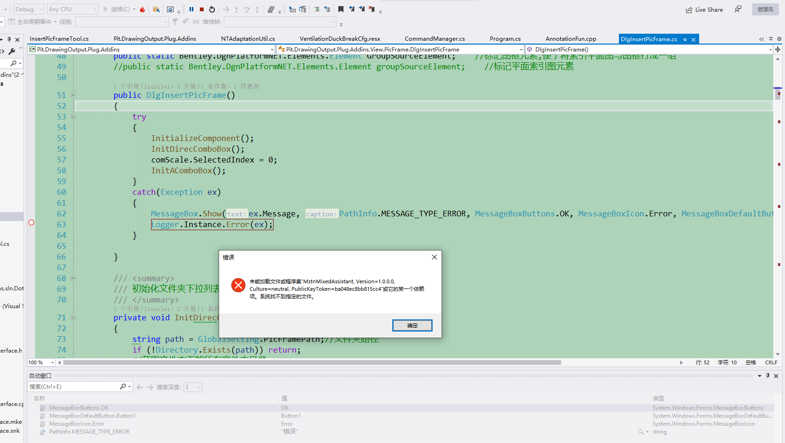
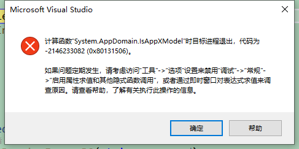
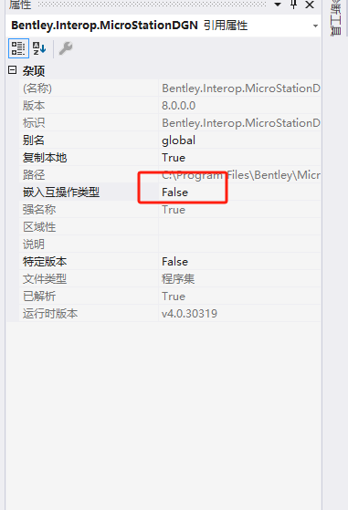
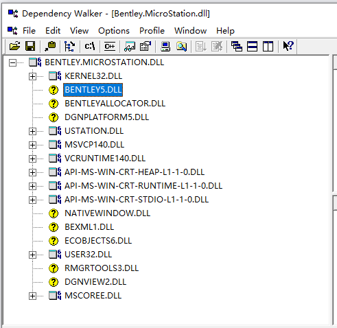

# 图框升级

## 主线任务：图框放置和修改升级

### 任务一：熟悉图框放置与修改流程

#### 工具启动入口Start

展示窗口

按钮事件触发后处理单元库

设置初始值

开始动态渲染事件

#### 插入动态事件Dynamics

坐标系旋转角度的获取与调整

创建单元格元素

设置单元格元素的图层

分析单元格名称并添加元素到模型

处理单元格的标签

#### 从文件中获取图框对象CheckCellName

初始检查和初始化

扫描模型中的单元格元素

检查指定的单元格名称是否在给定的设计文件中已经存在，并且如果存在多个类似的单元格名称，它会为新的单元格名称生成一个唯一的编号

### 任务二：替换旧的功能

可能需要升级的.cs文件：

InsertPicFrameTool、DlgInsertPicFrame、ChangeAttributeTool、NTPicFrameCommon、DQAdaptationUtil、NTAdaptationUtil、DQDlgAttributeChange、NTDlgAttributeChange

#### InsertPicFrameTool

Start->OnPostInstall

DataPoint->OnDataButton

**Dynamics->OnDynamicFrame**

**没有BCOM.Point3d，BCOM.View，MsdDrawingMode**

通过Dpoint3d转化为了Point3d，需要注意根据分辨率标准调节

调整函数结构MsdDrawingMode，绘制模式可以被优化，动态绘制有更新的代替

Reset->OnRestartTool

Cleanup->OnCleanup

#### ChangeAttributeTool

LocateFilter、**LocateFailed**无可替代

操作结束

**使用OnElementModify并根据element的ID获得BCOM.Element**

#### DlgInsertPicFrame

添加平面索引图AddPlantPic

将新的元素还原为了VBA格式进行操作。

#### DQDlgAttributeChange

读取图框中的平面索引图LoadPlanCell

。。。

### 任务三：优化图框放置

#### 不再需要平面索引图AddPlantPic

#### 不再需要索引图下拉框（注释）

## 支线任务：优化方法调用

...

幽默代码

08120939错误

