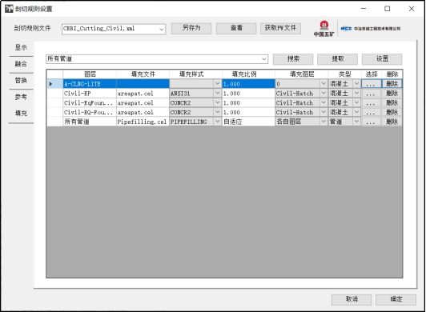

# 填充

## 任务一：熟悉剖切出图流程，找出填充部分

（1） 填充设置：

 

l 通过下拉框选择需要填充的图层（包含“所有管道”）。

l 可通过搜索与提取功能快速找到图层。

l 选择后点击设置，添加新的填充设置。

l 点击“选择”列的按钮“…”，浏览选择cel文件

l 写入填充样式与填充比例，选择填充图案所在图层

l 类型默认为混凝土，如果为管道图层，则需设置为“管道”

l 出图时，二维图纸中剖切线部分，需要按填充设置进行填充，填充图案的颜色根据“填充图层”中设置的图层设置。

l 存在“所有管道”设置，可对全局的管道剖切后的填充作用。

注：填充图层为剖切线替换后的二维图层。

完成设置后点击确定，将设置保存到规则文件中，并应用当前设置。

（1） **剖切规则设置逻辑说明**：

**在剖切规则设置窗口切换**xml文件后，窗口会读取xml里保存的规则，显示到**用户界面**上，但并没有**实际**作用到程序中。点击“确定”后，窗口才会将**界面中**的设置应用到程序上并将设置保存到**xml文件**上。

**在“剖切出图”“批量出图”“区域出图”里的下拉框选择xml文件**时，点击“**开始**出图**/出图**”按钮后才会将**xml文件**里的规则应用到程序上。

CSectionGraph::MakeGraph()生成图纸

在过程中调用//填充
	//添加需要填充的管道元素
	m_patternAreaRule->SetPipeElem(m_pipePatternAgenda);
	//设置需要填充的元素
	m_patternAreaRule->SetElems(m_patternAgenda);
	//执行规则
	m_patternAreaRule->RunRule();

### **主函数 `SetPatternArea`**：

- 该函数负责对给定的元素句柄 `eeh` 应用图案填充。其主要任务是通过内部函数 `getRegionEeh` 获取区域元素，并使用 `fill` 函数填充图案。
- 该函数还处理了对复合元素的打散操作，并处理了关联的区域元素填充。

**内部函数 `getRegionEeh`**：

- 该函数的作用是从给定的元素句柄 `tmpEeh` 中创建一个区域元素，并将其保存在 `regionEeh` 中。它设置了各种区域参数，并调用 `AssocRegionCellHeaderHandler::CreateAssocRegionElement` 来创建关联区域元素。

**内部函数 `fill`**：

- 该函数用于对给定的区域元素句柄 `regionEeh` 应用图案填充。它首先检查输入文件名是否为 `.cel` 文件，如果是，则尝试附加该单元库。然后，它设置了填充参数并应用到区域元素上。

**流程控制**：

- 主函数首先调用 `getRegionEeh` 获取区域元素。如果失败（如输入元素是复合元素），则打散复合元素并对每个子元素重新调用 `getRegionEeh`。成功获取区域元素后，应用填充并调用 `func` 处理完成的元素。

## 任务二：完成填充配置界面

更换配置文件并未加载

## 任务三：删除pw登录

 已完成按钮删除，相关引用：

getProFileFromPW_Click()

PW登录目录

XmlFolder

ProfileRuleSaveSuccessForm

## 任务四：单元素填充与全图一键填充

#### 单元素填充：

熟悉剖切出图流程，找出单元素填充需要的参数，以及填充限制条件

需要的参数：

EditElementHandle

fileName

cellName

patternLevel

patternAreaData填充数据

需要提取选中元素的图层，

步骤：在CPatternAreaRule::RunRule()

获取填充数据

元素id，模型，

Bentley.Drawing

将公共函数和项目内函数分开编写

Bentley.Drawing.Net

## 优化以及合并任务

- [x] 填充工具光标选择

- [x] 修改单选填充时的参数

- [x] 限定参数填充

- [x] 多选填充

- [x] 多选增加框选列

- [x] 恢复填充图层

- [x] 默认填充参数（可能没有默认单元库，StatusInt = 77841，找不到文件）

- [x] 选择按钮修复预选跳过判断（不可提前选中，需要返回并取消选中）

- [x] 
  填充时增加打散后的层次判断（~~第一个元素层次没有填充配置则无法进行，打散后需要匹配对应的填充配置~~）遇到单元先全部打散再填充

- [ ] ~~Common库归类~~

- [x] 路径归类GloableSetting

- [x] 注释库增加字体样式库选择

