# 廊道配筋出图

## 配筋

打开ProStructrues时，需要选择ProStructrues

打开项目：bmake -dIDE

板面属性：结尾带-DB

墙面属性：结尾带-VB

从小的一端开始是9y-1，依次递增

## 熟悉打入钢筋流程

确定点，连线，制成钢筋，钢筋端部调整

## Bug #72261：9y-8墙配筋，钢筋方向不对


与墙接触的部分钢筋端部翻转方向被反转，需要纠正

### 解决方向

目前处理为，判断为孔洞后被外翻，直接注释了反转。

更深层次可能是tmppts没有获取到，导致又翻转了


**如果点在墙内，而且没有与实体的交点，可能是遇到了孔洞，此时应该缩短**

`GetIntersectPointsWithHoles` 函数的作用是：

- 计算线段与多个几何形体（即“孔洞”）的交点。
- 根据交点结果，调整线段的起点和终点。
- 将交点存储在 `interPoints` 容器中。

按照原先逻辑，此时应该获取到与孔洞的交点，然后缩短钢筋，但是并没有获取到任何交点

实践为，不可以直接注释，否则9y-6楼顶的钢筋锚入方向会错误（此处钢筋方向会需要经历三次反转）


目前采取的解决方案为，如果GetIntersectPointsWithHoles没有检测到交点，用GetIntersectPointsWithHolesByInsert再暴力检测一次，能够解决以上问题。

但是9y-6某一面墙会出现多余半数钢筋方向向外，暂不知可否。


考虑注释PITGraphFunction生成时的错误，以便能够调试它，并查看更细节的GetIntersectPointsWithHoles


## Bug错误 #72263：9y-10墙配筋，钢筋延伸到孔洞里面

可能问题在于此处


想要不延伸到孔洞中，钢筋x轴必须小于218000，当前延伸到了231000

问题钢筋直径16C，长度19314


可能没有遇到孔洞截断的操作，考虑从面配筋中移植类似的功能CutRebarAnchorLeng

在ReCalExtendDisByTopDownFloor中进行截断，先获取孔洞实体。在延伸路线上如果经过孔洞时，根据孔洞重新计算该方向的最远点。

得到起止点后，根据生成的线与实体求交点，使用离墙最近的点作为新的起止点。

参考01：

行4946


## Bug#73690 墙配筋竖筋锚入孔洞或空处理优化

1、锚入长度的计算需要考虑弯钩的半径；

2、弯钩本身就已经超出墙范围，反转再截短；

3、需要解决反转后仍然没有锚入到墙内以及孔洞；

## Bug#73895 墙配筋Z形板水平钢筋延伸长度优化

当前已知逻辑为：

先判断板，如果在墙内，则之后不再延伸。（此时FLAG为2）

冲突逻辑为：
如果在墙外，中间有墙时会被阻拦，无法延伸到板。

目标：

墙内逻辑不变，先判断板，遇板停止延伸。

目前：

检查交点是否接近端的交点集合，此时表示可继续延伸。

增加一次对于所有板的判断，解决墙后仍然存在板的情况。


以上两个修改均为健全逻辑

## Bug#74014 墙配筋对板产生影响

在OnBnClickedOk中出现了识别错误

## Bug#73989 墙配筋横筋未锚入到实体中

在endTypes初始化时，就没有给endTypes.end合理的值。目前为近似0的值。

中途因为某些原因，endTypes.end被替换为了Hol。但是没有更新lenth2。

在判断锚入点尾端时，却使用了近似0的lenth2。目前直观优化方向为实时更新lenth2。

## Bug#70556 面配筋点筋对齐

可能是排列时选择的初始点位置问题。

与边界的距离分别是181,200.两块板的前后边距相反。钢筋之间的距离均为固定的150，在4658行开始根据150逐渐偏移得到所有钢筋起止位置。偏移代码为：

rebarLine.PerpendicularOffset(adjustedSpacing, offsetVec);

方向一：

根据宽度，钢筋半径，钢筋间距，保护层计算新的间距。争取最后两边保护层距离相同，或可实现对齐。

发现可能的问题点：
重复给adjustedSpacing赋值。

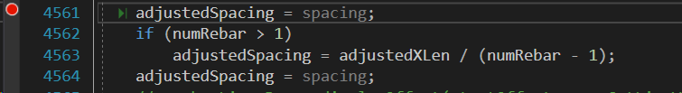

将多余的赋值注释后，得到理想效果：

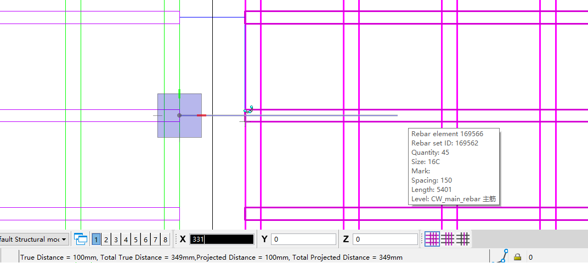

纠正目标，不仅需要前后对齐，还需要上下对齐，而且还需要对周围的墙做出反应，效果参考板配筋：

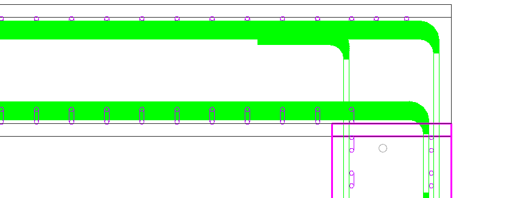

参考板配筋效果其一：

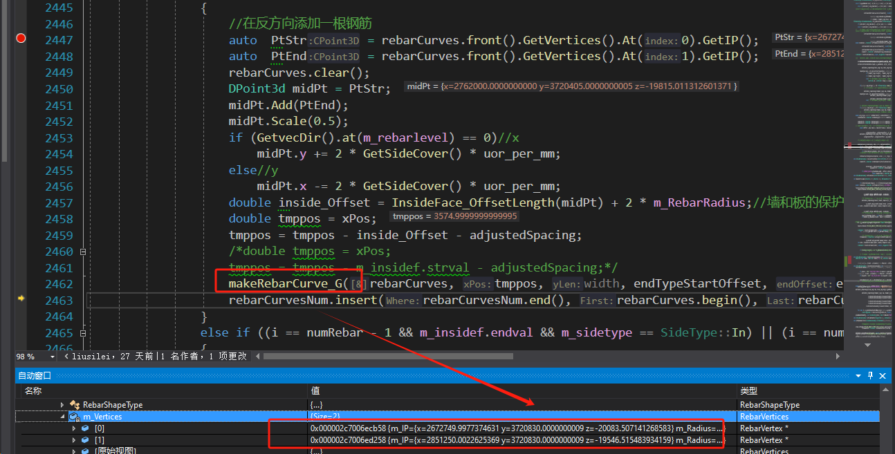

### 板配筋主要相关逻辑

点击事件判断结束后首先进入

bool LDSlabRebarAssembly::**MakeRebars**创建钢筋

根据扫描的墙，将板分类进入

void LDSlabRebarAssembly::**CreateInSideFaceAssembly**

计算内侧钢筋数据**CalculateInSideData**得到m_insidef，关于根据上下墙分割后的板区域处理

分区域绘制单层钢筋

void LDSlabRebarAssembly::**MakeFaceRebars**

由**MakeRebars**得到tag存入rsetTags

RebarSetTag* LDSlabRebarAssembly::**MakeRebars**------**RMakeRebars**

板配筋判断钢筋根数在

2133-2168：根据宽度得出基本钢筋数numRebar

2413-2491：根据分块求出rebarCurvesNum，如果周围有墙会延伸一根。

### 面配筋主要相关逻辑

点击事件判断结束后首先进入

bool PlaneRebarAssembly::**MakeRebars**创建钢筋

扫描附近的墙，获取面的类型以及相关配置参数，计算

void PlaneRebarAssembly::**CalculateOutSideData**

确定面类型以及位置后，由**MakeRebars**得到tag存入rsetTags

RebarSetTag* PlaneRebarAssembly::**MakeRebars**------**RMakeRebars**


方案一：

虽然板结构中，在一层的**MakeRebars**将板区域分割进行了处理，但是如果排除一些其它的处理，面配筋可以考虑直接在最后一层的**MakeRebars**中分割，并分批处理。

### 面配筋板结构能够根据墙进行分区配筋。

步骤：

- [x] 其一：分析板配筋进入**CreateInSideFaceAssembly**的条件，如果问题不大，采用其中调用**MakeFaceRebars**的方式修改面配筋中原本使用**MakeRebars**的方式。

- [x] 其二：修改面配筋部分头文件，主要为m_outsidef的结构，能够存储钢筋线平行的边坐标区间。

- [x] 其三：修改**CalculateOutSideData**使其支持钢筋分区。

- [x] 其四：在**RMakeRebars**将增加钢筋上方添加钢筋的逻辑。

Bug：

m_outsidef中存入分区的起点和计算每根钢筋时相反，导致使用错误的间距

考虑倒序遍历或者更改遍历规则AnalyzingFaceGeometricData，可能需要修改lineSeg1以及相关

可能的需要修改点：
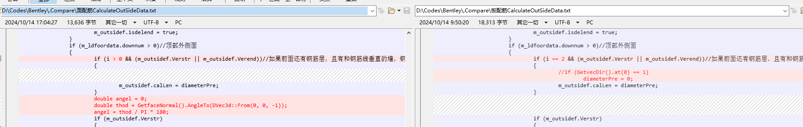

不能使用m_outsidef.isdelstr判断删除，还是需要单独设置

不能使用startOffset判断偏移，会造成负数，可以采用板的方案

主要问题：

一面中只生成一组钢筋。需要新的rebarSetId，否则只是重复写入同一个

- [ ] 分区的起点和第一根钢筋起点不同
- [ ] 计算墙上偏移参数有问题，目前为内侧
- [x] 分区宽度计算太窄。因为updownSideCover，尝试移除
- [x] 内侧应该取消初始的偏移，交给分区解决偏移问题
- [ ] 根据分区计算钢筋数时，板(+0.5)和面(+0.85)的间距计算不同，导致部分区域面的钢筋会更密集。

当分区方向和默认方向一致时，可以配筋成功。

考虑在计算区间tmpqj时，使用默认方向。

​	目前已知会有一个计算墙元素范围的部分，考虑将这个范围的默认方向修改

​		右外侧面，vec = {0,-1,0}，可用

​		右内侧面，vec = {0,-1,0}，不可用

​		左外侧面，vec = {0,1,0}，不可用

​		左内侧面，vec = {0,1,0}，可用（但是多余了偏移）

对于内侧面，如果vec =  {0,-1,0}，方向反转，并将起点终点y轴偏移

对于外侧面，如果vec =  {0, 1,0}，方向反转，并将起点终点y轴偏移

部分区域偶发性没有端部样式->必须和锚入的面同时配筋才会有端部样式-不是问题

#### 纵向钢筋分区

- [ ] 区分内外侧
- [ ] 定位分区的起点

真正的板下方有真正的墙，能够正常分区；

Z型板面配筋的面之间并没有真正的墙，无法分区；

简单处理思路：纵向起点和终点相反，可以增加添加钢筋时的判断条件dir

#### 优化方向处理方式

通过GetPlacement可以得到局部坐标原点，分区会根据此计算。考虑将初始向量也修改为此方向。

#### 纵向偏移方式

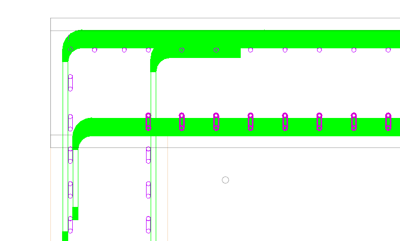

Z型板短面构造的实体偏移钢筋后无法计算锚入。

Q：根据当前面转为实体并加厚，所以偏移后的钢筋不在范围内，无法计算起止点。

A：额外的钢筋使用“原实体”m_pOldElm的处理方案

Q：同一面板上分为多面时，会偏移到其它的面上

Q：某些Z型极限位置会导致边缘钢筋无法计算起止

S：确定为长板，取到差值分界线，构造向量组，分段配筋

S~：根据与对应面投影得到公共长度，进而得到间距。


S_：如果遇到对应面长短不一，使用公共（短）间距。板方向短面按照完整间距额外加一根，长面去掉最后一根；墙方向不做处理。

S_：公共间距额外一根，以及长面对应位置，应当或多或少处理间距？

S_：公共区间计算：已知厚度，面的y1和y2，当任意y近似且另一y差值近似厚度时，再依据y差值判定为对应以及长短面所属。

S_：~~墙类公共区间计算：已知厚度，面的y1和y2，去掉距离最大的y，使用对应较近的y计算公共区间，得到间距~~。墙类对应长度相同，保证保护层相同情况下，直接计算即可。

S__：既已知向量，可在Cal计算分区，从起点yStr到最短公共y点，再到yEnd


S+： 按照板的y设定折点集合，跨越三个点判定为长，两个点为短。两个点间距为厚度判定为Z拐，长面使用短面间距并去掉一根（第一根），短面增加一根（最后一根）。间距大大多于厚度判定为连续面，不做处理。


分区方向，板设定为内外均相同，水平钢筋从高y往低y，竖向钢筋应该从低x往高x。

面可以是绝对性从低到高，后期将向量改变即可。

m_LineSeg1为X方向，墙类时为Y方向

m_LineSeg2为Y方向，墙类时为Z方向

关键在于将分区也同方向。

S.：从矩阵方面规范。自定义一个在板某个角上，可以保证坐标系上从低到高。

目前发现顶面的矩阵原点在右下角（z低于面），底面矩阵原点在左上角（z高于面）

S1：~~重新根据新的原点规划矩阵~~（涉及与孔洞等的比较，影响无法估计）

S2：判断矩阵原点位置，如果z低于面，倒转分区。

S21：如果有z拐，应该有z拐点y1，y2，y3从左至右。遇到Z拐时，z高于面，正常从左至右，Z拐在左此时tmpqj应该存入{0,y2-y1}，Z拐在右{y2-y1,y3-y1}；z低于面，则从右至左，Z拐在左此时tmpqj应该存入{y3-y2,y3-y1}，Z拐在右{0,y3-y2}。

**新发现**：外侧分区方向为反可能是因为m_ldfoordata.Ylenth - (int)tminP.z

修改后，分区方向均正常

S22：分区方向实则与局部坐标系原点有关，尝试在定位局部坐标系时也规定绝对性的xy从低到高

Bug：~~设定绝对坐标系时可能遗漏了Z的变化~~


可能需要考虑不同Z拐情况下的分区问题

本面范围更大（拥有更低或更高的点）则构建区域元素

Min - S == dis && Max == E，左长，从对面构建，填充 

S - Min == dis && Max == E，左短，从自身构建 

Min == S && Max - E == dis，右短，从自身构建 

Min == S && E - Max == dis，右长，从对面构建，填充

偏移钢筋位置还需要纠正，大致为本面保护层厚度+墙面保护层厚度

### 面配筋墙结构钢筋对齐

A：墙本身在延伸到板后，也有一定的间距变化。

在CalculateBarLinesData就得到“分区”barlines，包括内外侧

​	更具体来说，是在CalculateLeftRightBarLines计算偏移

在GetVecToCurve得到每一根钢筋的位置

S。：如果上下其中一个端点移动半数厚度位置，还在Z型板实体内，则另一方向需要分区

Q·：面配筋墙结构未对齐，间距不同。DealWintHoriRebar将边缘延长了

Q：DealWintHoriRebar中尝试将对于Z型板墙结构和真实墙结构的分区逻辑需要配合，要考虑Z型板起点不一定为0，以及真实墙的分区也要考虑。

## Bug#面配筋Z型板结构钢筋偏移（待客户提出优化）

尝试获取对应墙结构的钢筋布置信息

正确的偏移距离=本钢筋半径+本钢筋到边缘距离+墙保护层（50）+第一层直径+第二层半径

使用GetMainRebars().at(i).rebarSize得到当前层钢筋参数，比如直径信息20C

MakeRebars中有sizeKey存储目前钢筋参数

## Bug#面配筋锚入孔洞（待客户提出优化）


## Bug#75562面配筋钢筋密度稀疏

在顶板位置，上方也有墙时，会尝试避让。

过滤过于短的墙体

## Bug#有钢筋分区方向异常

局部坐标系的y轴过高

修改局部坐标系，确保y轴方向，z轴方向

## Bug#75500面配筋上下都有墙的面被判定为内侧面，缺少钢筋

板配筋有一个m_isMidFloor，在4632行处理

顶面，因为中间位置和终止位置和顶上墙均有交点，判定为In

底面，因为和底下墙有交点，判定为顶面的In

如果起始和终止位置没有需要删除的钢筋且没有垂直交叉，则返回 `SideType::Out`，表示该面为外部面。

过滤墙的基础条件是长和宽均少于六成。集水坑的Y长度不满足。

Q1：底面应该判定为外侧面；

Q2：顶面作为内侧面应该不需要考虑下方墙体分区；

S1：底面判断内外侧面时，不仅考虑交叉，还需要考虑长宽占比，均超过八成才算内侧面。

最右侧一块墙属于终点范围内，IsHaveVerticalWall得到结果2

S2：~~内侧判断避让墙体可以使用mdlElmdscr_intersectShapes，并适当扩大范围~~暂时根据长度过滤集水坑的短墙，不超过8成就忽略

Q3：~~IsHaveVerticalWall也需要判断相对长度~~与孔洞规避有关，不便修改

S11：尝试对集水坑和装饰墙体进行判断，特征主要有：

能够形成封闭空间；范围比支撑的墙体小；

S111：IsHaveParaWall增加参数，仅在判断内外侧调用该参数。IsHaveVerticalWall增加参数。并尝试用三次IsHaveVerticalWall，均有垂直墙才算内侧。任意IsHaveVerticalWall返回0，则为外侧面。


## Bug#75501面配筋部分相对面无法拿到相邻墙实体

问题在于GetUpDownWallFaces没有获取到，它被AnalyzingFloorData调用

9y-11上板底面的Same_Elesup只有本身。

m_ldfoordata的Zlenth很长，更有可能是坐标的问题。
Z型板的厚度计算有误，不能用顶底板差作为Zlenth。某些矩阵转换时，Z型板也可能造成问题。

与底板接近且与顶板距离一个厚度||反转情况，正常板不操作；

与底板接近且距离顶板较远，Z下半底板，~~maxP2改为minP2+厚度~~，自本身向上构造虚顶面；

与底板接近一个厚度，且距离顶板较远，Z下半顶板，~~maxP2改为minP2+厚度~~，自本身向下构造虚顶面；

与顶板接近一个厚度，且距离底板较远，Z上半底板，~~minP2改为maxP2-厚度~~，自本身向上构造虚顶面；

与顶板接近且距离底板较远，Z上半顶板，~~minP2改为maxP2-厚度~~，自本身向下构造虚顶面；

Q：厚度5998略低于实际厚度6000，导致偏移得到面的最低点偏高，而无法接触下方实体导致检测失败。

S：厚度计算时尽可能消除噪声

```c++
m_slabThickness = round(m_slabThickness / 10.0) * 10.0;
```


## Bug#75984 9y-11面配筋上下面钢筋数量不齐

密度有误

81766和81746

一般是初始时有些微误差，存储作为参数传递，尽可能整体消除误差


## Bug#75813 面配筋外侧面需要锚入集水坑

需要确定m_Allwalls是否代表周围所有的实体

优先锚入周围墙体，即末端不在本体内，且在m_Allwalls。

正常情况，已经锚入到板内合适位置，反转后不在。尝试锚入其它实体。

异常情况，本身就是锚空，则反转，如果反转也锚空则取消锚入

有可能本身就锚入其它实体，此时不能算异常情况

在遭遇孔洞时，会使用GetHoleRebarAnchor

S。：需要考虑锚入长度，参考GetHoleRebarAnchor

S！：每次都考虑周围墙体范围，如果钢筋末端在范围内，而且并没有锚入。则反转并重新设置法向量，锚入长度，半径。还可能需要规避孔洞和锚空。

S！！：重写已经破败のIsHaveVerticalWall。

S*：如果每一个端点都要单独计算锚入会花费大量时间，考虑记录到endtypes，可以大大减少判断次数，如果出现不同锚入，则其后一区域都可以延续而减少计算。

### 配筋出图第二次测试

步骤：配筋，出图，横竖剖切图

Bug# 9y-5和9y-8配筋图点击剖面图，PS会崩溃


Bug# 9y-7配筋图墙板位置不对

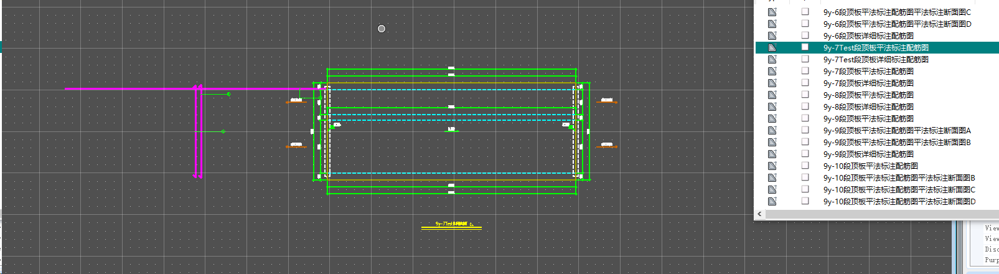

9y-1&2&3(上)&5(上)&8墙多余钢筋

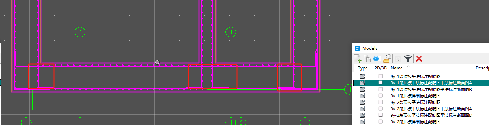

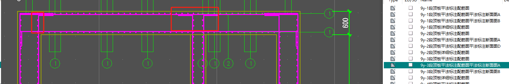

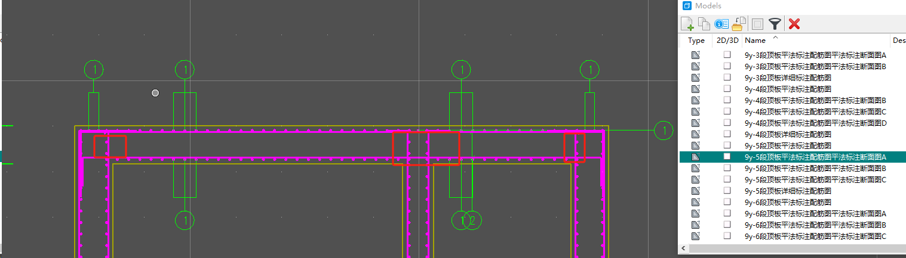

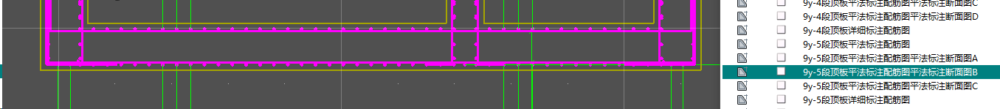


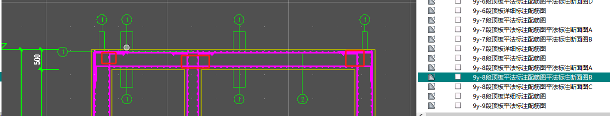

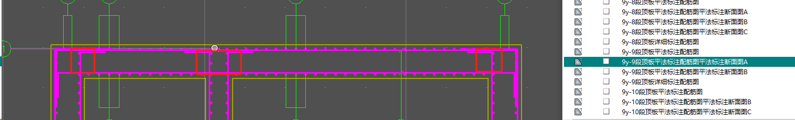

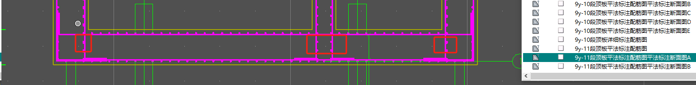

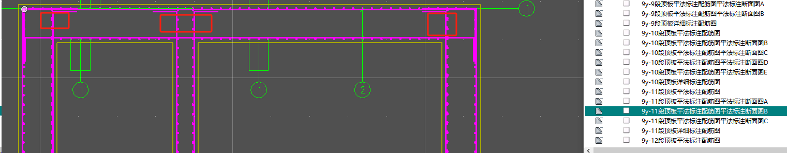

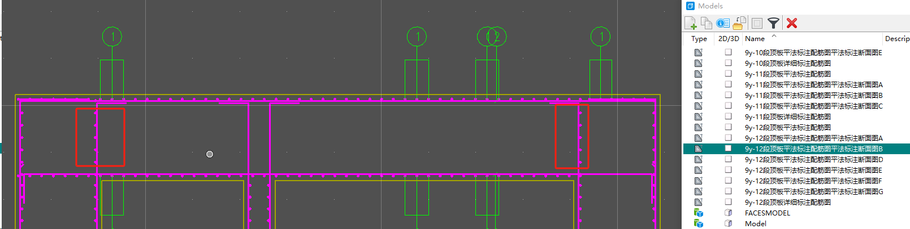

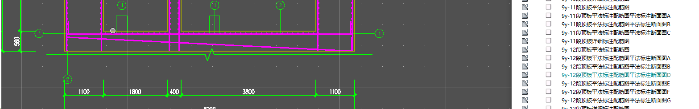

9y-3&4&10板多余钢筋

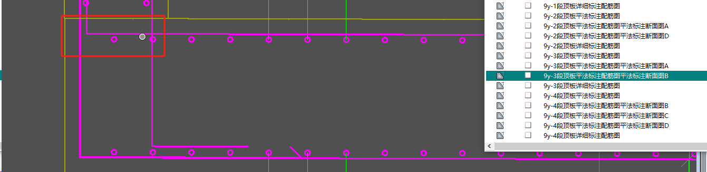

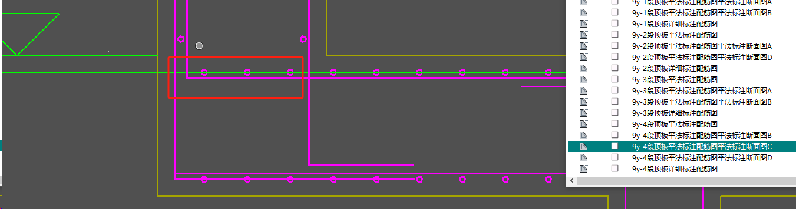

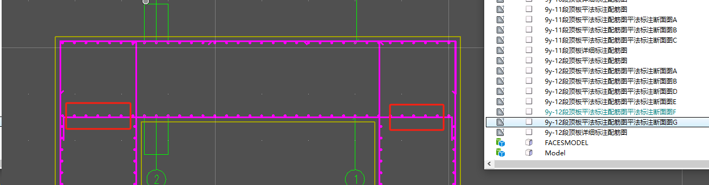

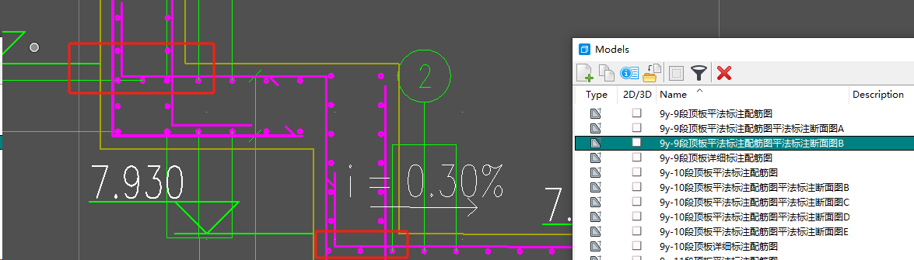

9y-6(部分是装饰墙的额外钢筋)&10未知多余钢筋

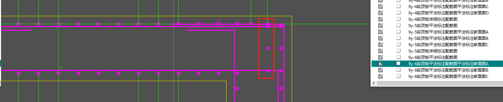

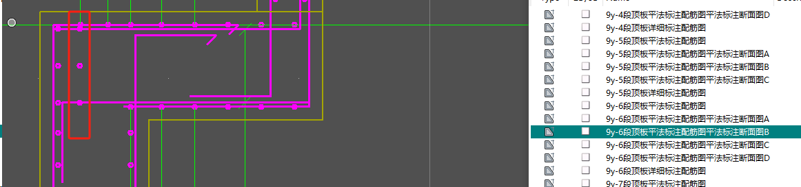

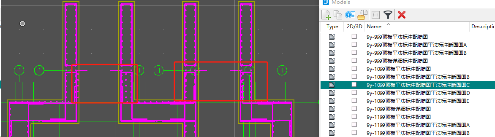

9y-1 Z型板横竖内外位置


模型问题导致没有向上锚入（图1实体参数似乎有问题，图2实体有间隙）

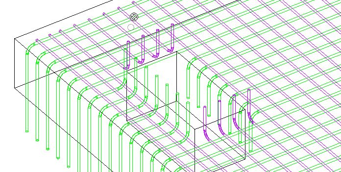

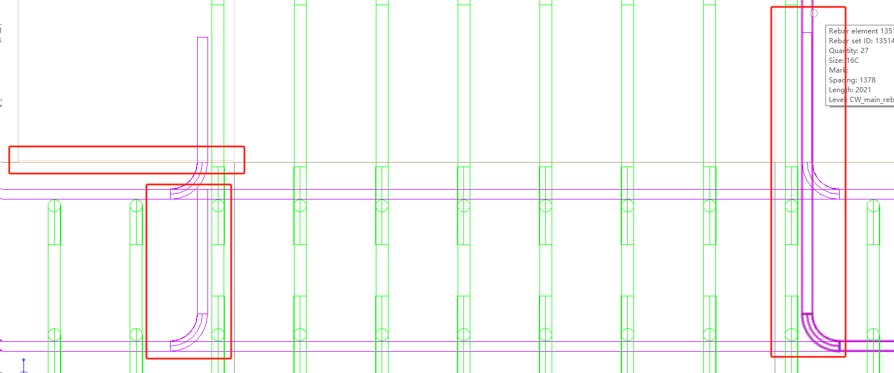

sk-6板配筋底板锚空

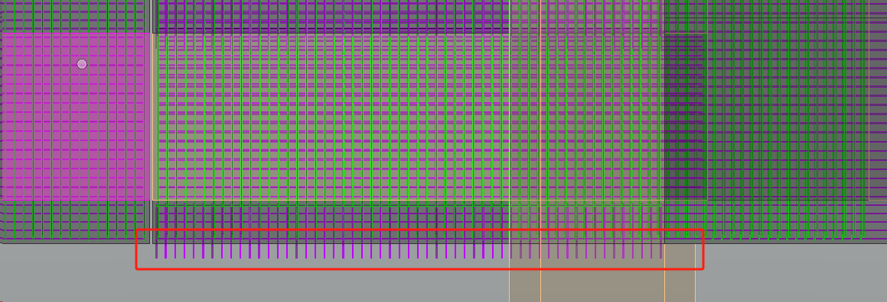

sk-6墙配筋锚空

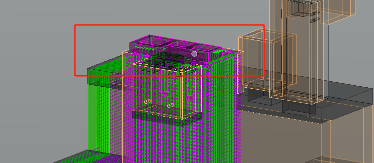

sk-6板配筋锚空

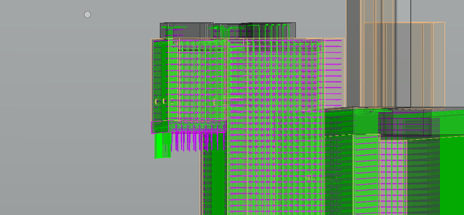

sk-6拉伸实体墙配筋会崩溃

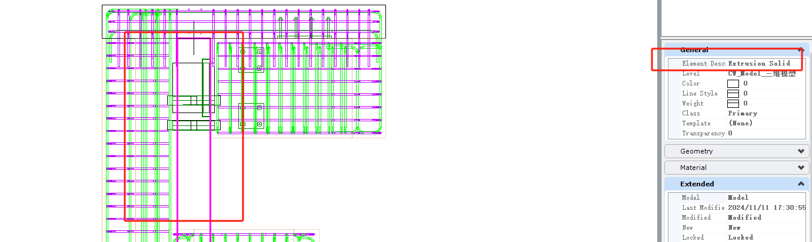

按照图纸应该向上锚入

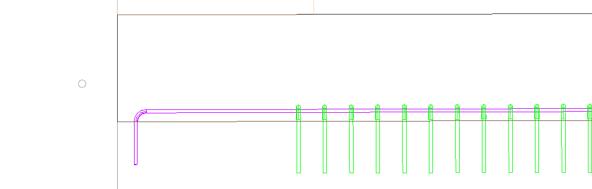


sk-6 面配筋锚空

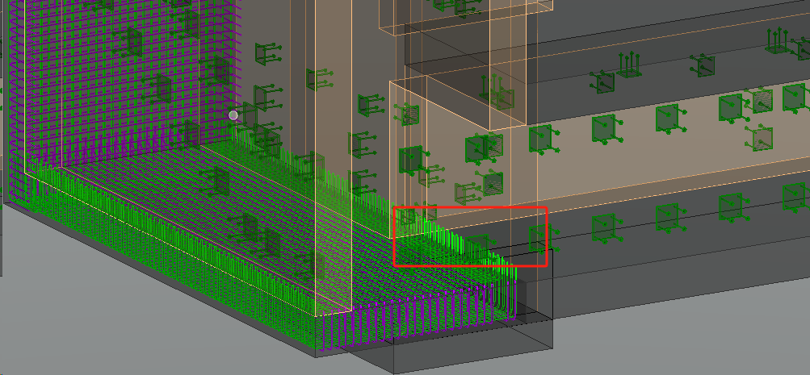

## Bug#76227 sk-4面配筋Z型板外侧竖直墙无法配筋

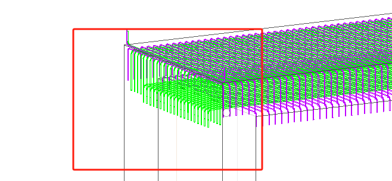

发现问题有二，一为厚度计算，二为纠正定位，均在AnalyzingFaceGeometricData内

一：竖直有极短部分，被误认为厚度。

二：不再以墙板为区别纠正定位向量。平等对待。

厚度目前对于该位置并无影响，仅向量。

## Bug#76229 sk-4面配筋Z型板竖向钢筋未分区对齐

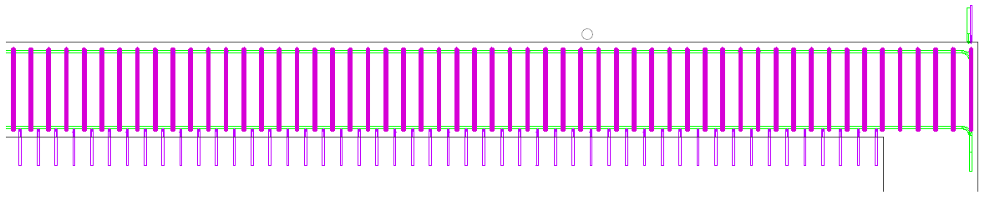

原先只保证X轴走向，这里需要额外考虑Y轴走向。

通过加入XDir参数完善Y轴走向，但是竖直面厚度判定有误，同76227，导致分区出现问题。

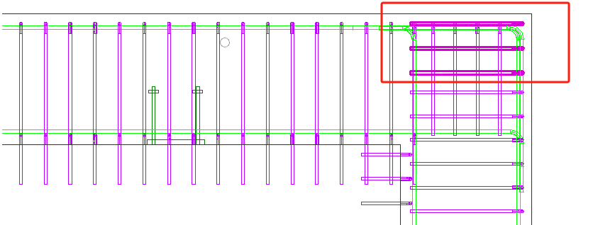

优化厚度计算

S1：取中点，往xyz正反六个方向均延伸起止点距离，与实体做交，最短的有效交点距离作为厚度。

S2：根据原实体板墙属性，板结构仅采用法向量与Z轴垂直的面求最近距离，墙结构使用选中的面与平行面求厚度。

Q2：还是有特殊情况，在9y-12集水坑，存在切割后的面非常近。


## 面配筋优化总结

- 内外侧
- 延长
- 锚入
- 某些计算未考虑异形板，例如Z型板的顶底高度差不能用来作为厚度

优化方向1：选择区域配筋，不局限于构件

优化方向2：选择锚固面，可以显示周围可锚入的实体，需要能够隐藏不需要的面

参考：

https://help.autodesk.com/view/RSAPRO/2023/CHS/?guid=GUID-876270B6-0662-4797-8A76-6BA5C141B82E