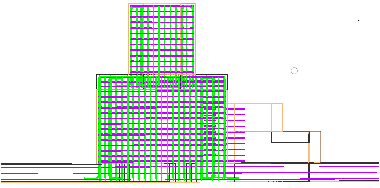

# 廊道配筋出图

## 配筋

打开ProStructrues时，需要选择ProStructrues

打开项目：bmake -dIDE

板面属性：结尾带-DB

墙面属性：结尾带-VB

从小的一端开始是9y-1，依次递增

## 熟悉打入钢筋流程

确定点，连线，制成钢筋，钢筋端部调整

## Bug #72261：9y-8墙配筋，钢筋方向不对

与墙接触的部分钢筋端部翻转方向被反转，需要纠正

### 解决方向

目前处理为，判断为孔洞后被外翻，直接注释了反转。

更深层次可能是tmppts没有获取到，导致又翻转了

**如果点在墙内，而且没有与实体的交点，可能是遇到了孔洞，此时应该缩短**

`GetIntersectPointsWithHoles` 函数的作用是：

- 计算线段与多个几何形体（即“孔洞”）的交点。
- 根据交点结果，调整线段的起点和终点。
- 将交点存储在 `interPoints` 容器中。

按照原先逻辑，此时应该获取到与孔洞的交点，然后缩短钢筋，但是并没有获取到任何交点

实践为，不可以直接注释，否则9y-6楼顶的钢筋锚入方向会错误（此处钢筋方向会需要经历三次反转）

目前采取的解决方案为，如果GetIntersectPointsWithHoles没有检测到交点，用GetIntersectPointsWithHolesByInsert再暴力检测一次，能够解决以上问题。

但是9y-6某一面墙会出现多余半数钢筋方向向外，暂不知可否。

考虑注释PITGraphFunction生成时的错误，以便能够调试它，并查看更细节的GetIntersectPointsWithHoles

## Bug错误 #72263：9y-10墙配筋，钢筋延伸到孔洞里面

可能问题在于此处

想要不延伸到孔洞中，钢筋x轴必须小于218000，当前延伸到了231000

问题钢筋直径16C，长度19314

可能没有遇到孔洞截断的操作，考虑从面配筋中移植类似的功能CutRebarAnchorLeng

在ReCalExtendDisByTopDownFloor中进行截断，先获取孔洞实体。在延伸路线上如果经过孔洞时，根据孔洞重新计算该方向的最远点。

得到起止点后，根据生成的线与实体求交点，使用离墙最近的点作为新的起止点。

参考01：

行4946

## Bug#73690锚入需要截断

1、锚入长度的计算需要考虑弯钩的半径；

2、弯钩本身就已经超出墙范围，反转再截短；

3、需要解决反转后仍然没有锚入到墙内以及孔洞；

## Bug#73895墙配筋Z形板水平钢筋延伸长度优化

仅延长了14931单位

当前已知逻辑为：

先判断板，如果在墙内，则之后不再延伸。（此时FLAG为2）

冲突逻辑为：
如果在墙外，中间有墙时会被阻拦，无法延伸到板。

目标：

墙内逻辑不变，先判断板，遇板停止延伸。

目前：

检查交点是否接近端的交点集合，此时表示可继续延伸。

增加一次对于所有板的判断，解决墙后仍然存在板的情况。

## Bug#74014墙配筋对板产生影响

在OnBnClickedOk中出现了识别错误

## Bug#73989墙配筋横筋未锚入到实体中

在endTypes初始化时，就没有给endTypes.end合理的值。目前为近似0的值。

中途因为某些原因，endTypes.end被替换为了Hol。但是没有更新lenth2。

在判断锚入点尾端时，却使用了近似0的lenth2。目前直观优化方向为实时更新lenth2。