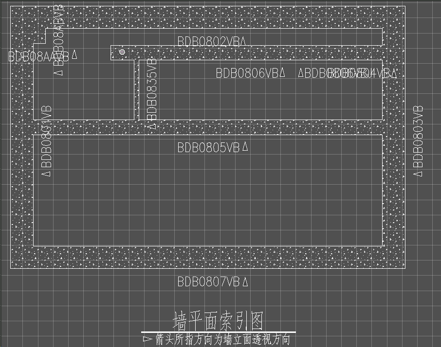

# 核岛出图-索引图

备注：获取文字真实范围函数待统一。

## 功能说明：

1.组合、单厂房，构件连接位置线条融合，美化。

2.生成所有的墙缩略图，需要不同厂房生成在同一个图中；

3.将相交的线条进行融合处理；

4.需要添加选择对应的缩略图进行自动填充的功能。

5.墙名标注与墙边线距离需要开放参数调整（暂定默认为 300mm）。

## 处理：

1) 在缩略图界面增加“自动填充”选项和“墙名标注与墙边线距离”参数设置入口；

2) 读取构件信息，按照所在楼层进行分类，且不区分厂房；

3) 对同楼层的生成一张缩略图；

4) 缩略图中的构件进行融合处理；

5) 根据“自动填充”选项进行判断，若勾选，则进行自动填充，若不勾选，则不进行自动填充；

6) 生成墙名标注，并将位置确定在距离墙边线一定位置处，该距离由设置的“墙名标注与墙边线距离”参数确定。

## 验证标准：

1) 缩略图墙体融合；

2) 不同厂房可在同一缩略图中表达；

3) 同厂房不同层在不同缩略图中表达；

4) 缩略图是否填充可设置，并按照设置表达；

5) 墙名标注与墙线存在指定间距，且间距可设置。

## 参考界面

## 互相接触的墙的线条进行融合

可以参考PITCommonTool::CFaceTool::CombineFaces

当前大致逻辑可能为：遍历选中的墙，符合条件的墙绘制索引图并绘制对应的文本标注和三角形

S：将每次将要绘制的MSElementDescrP存储到vector，用于后续的融合&填充。

CreateGWallIndexChart无需修改，使用isReturn参数即可。

CreateSTWallIndexChart将isReturn移动至最后，防止其它参数未调用。

调用已知的GetFusionElem和CombineFaces完成融合功能。

FusionShape处理所有墙能完全融合为一个元素或多个元素的情况

## 缩略图可自动填充

"AreaPat.cel"

使用CONCRT填充水泥

调用已知的SetPatternArea将元素创建无边界的填充范围并填充

AutoFillArea遍历所有的元素，使用指定的缩放和填充参数。

## 墙名标注与墙边线距离可参数调整

可能在CreateArrowAndText附近

界面开放参数调整，绑定g_annotationDistance

CWall增加m_dAnnotationDistance控制偏移距离

在将墙添加到索引图时，指定其偏移距离

标注符号目前只根据法线的x值决定偏移方向以及距离，对于横向的线处理有问题。

偏移距离参照标注文字，直接偏移指定数值。偏移方向需要获取文字跨度，在边缘即可。

三角形原高度为2800mm，在索引图中大小为560000mm，约200倍。

偏移需要适配原先比例。

## 二维索引图根据楼层厂房分类

stru组名示例：1BDA08-B、1BDA16-B、1BDB08-B

分析：1BD可能代表区域，A代表厂房，08代表层。

仅需要当层相等时保存在同一索引图即可。

基本结构必须保存为map<string, vector<string>> Selectwalls;

键为stru，值为所拥有的墙组vector

在创建索引图时，根据规则创建指定名称的索引图后，将层相同的结构存入同一张索引图

S1：在从树状图读取选中的厂房时，如果以及有同层的厂房，以同一个键存入Selectwalls，值叠加。在绘制时，使用第一个stru创建索引图model以及相关操作，其后遍历

S2：记录每次创建了索引图的stru，如果后续有stru属于同一层时，则打开创建过的索引图进行写入

S3：使用层级标识，例如 "08"作为键，将同一层的数据合并到一个键中，

DrawVisibleEdge第一个参数很重要，已知名称查不到则没有图，使用第一个结构则只有第一个图

## 三维索引图根据楼层厂房分类

## 三维缩略图标注位置修改

UOR_PER_MM可能跟位置有关，会将坐标根据模型修改

标注位置并没有错，问题在于模型位置。

结构如果没有其它“参照物”，则坐标会错误。

结构如果没有在主模型中显示，则不能在索引图正确显示。

将三维模型的视图参考到二维模型model中，并缓存可视边，但是如果显示的元素组没有跨过原点(0,0,0)，就会将元素组中间作为原点，失去原有的坐标。

**重大进展**：错误的参考进行了偏移导致位置错误。

目前发现是因为使用

refToCreate->ApplyNamedView(L"NowView", 1.0);

然后视图中心发生了变化。

下方得到的modelpt是零点，并且SetRefOrigin了。

refToCreate->GetMasterOrigin(modelpt);
refToCreate->SetRefOrigin(modelpt);

但是调用下方的代码能看出来，SetRefOrigin并没有生效
origin = refToCreate->GetRefOrigin();

右键十分卡顿，严重怀疑与绿盾强相关。

绿盾对于Win11的支持存在问题，待对方公司改进。