# 核岛出图

## 尺寸标注优化

### 优化点

内部标注拥挤且重复

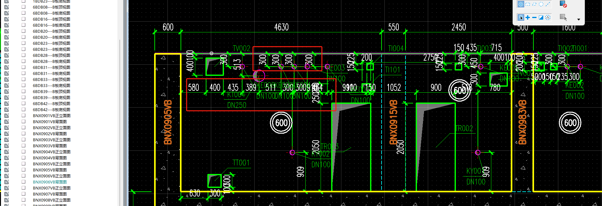

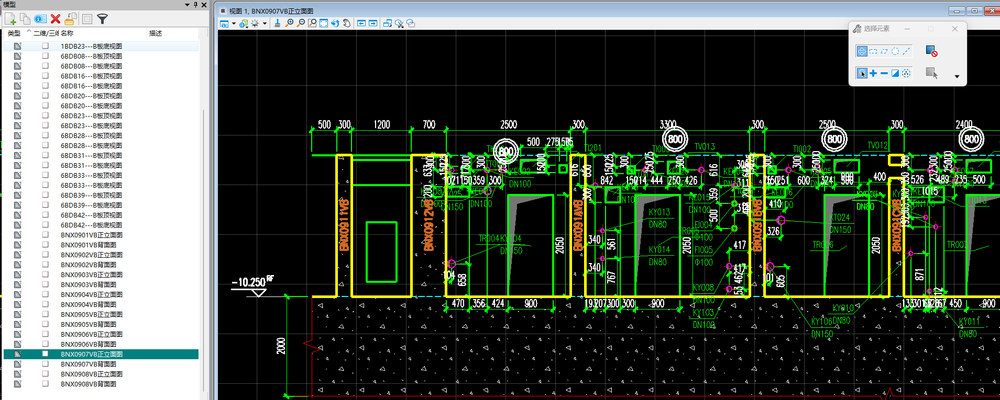

重复重叠的标高

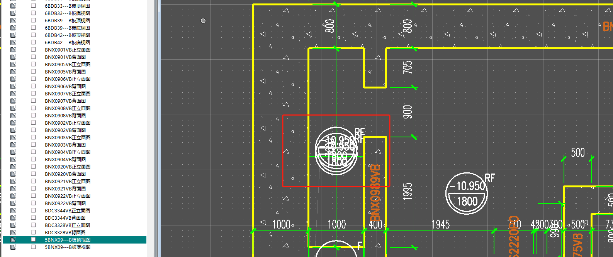

重复的标注

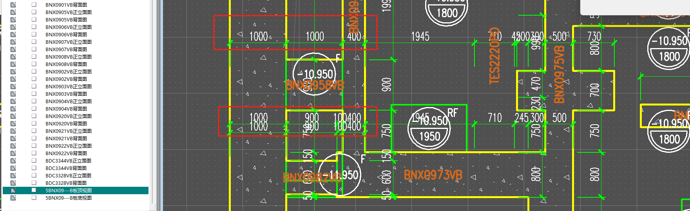

<u>**重叠的标注数字**</u>

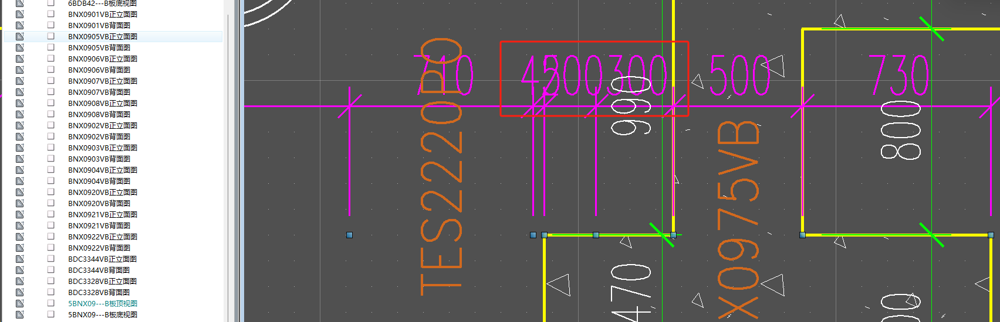

标注结合，如果同方向多个标注，可以用一个概括

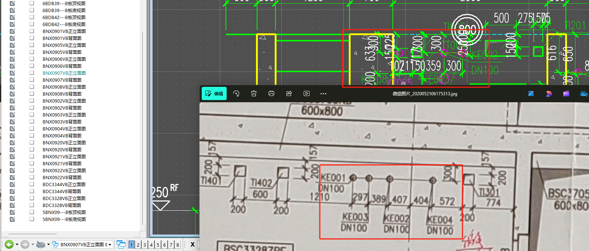

### 优化方式

粗略计算标注数字跨度，超过所标注的区间范围时，且附近的标注没有反转，则进行反转（需要设计一个合理的反转条件）。

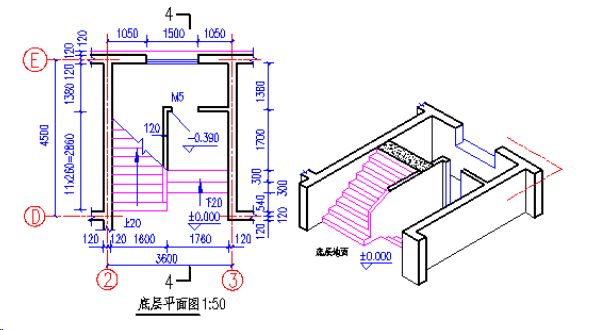

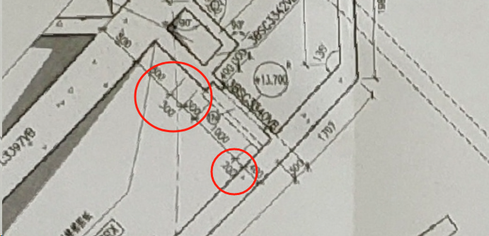

标注数字与标线重叠时，也可以考虑数字向外移动些许，甚至可以向一侧偏移

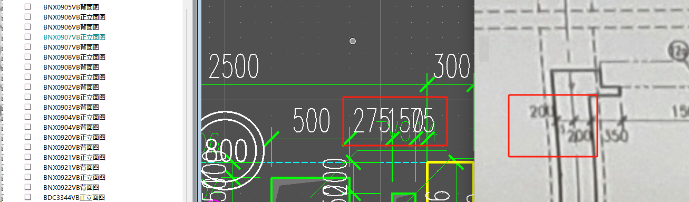

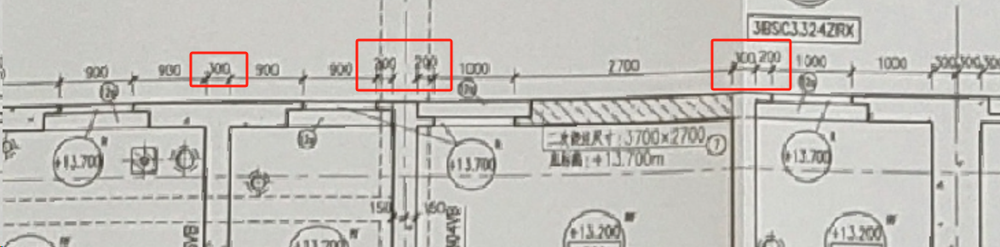

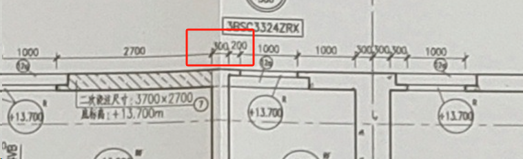

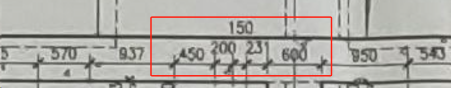

对于向外和不在边缘可偏移的情况，还要考虑向内侧偏移，并处理原先位置的标注

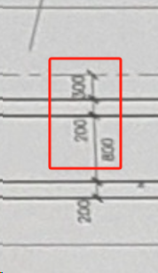

重叠部分可以选择旋转文字，可以适当减少重叠程度

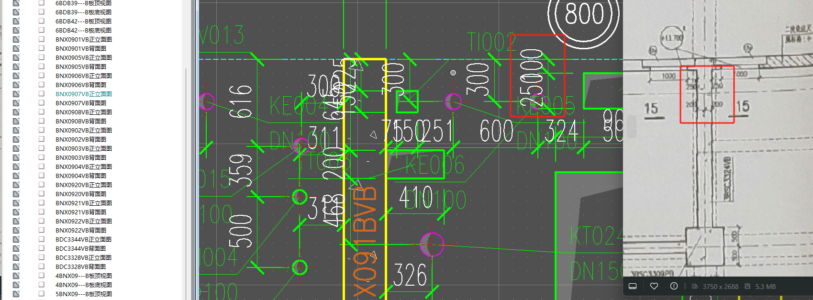

### 多个平行的套管标注可以只保留一个

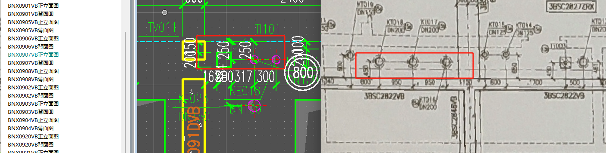

需要找到对应的尺寸标注。目前找到的是管道名称标注。

大致范围在DimAllHolesPos

套管归属于孔洞holes，会按区域将孔洞holes分组

在AddHolesToModel进行具体的参数设定，比如形状

每一个孔洞单独调用createDim创建标注

S：创建标注之前处理孔洞组，在Y轴按层分类，在X轴只选择范围最大的孔洞

newAreaRanges代表划分区域

S：对于不重复的组，额外进行降重处理

S：根据标注方向，调整到最边缘的位置，水平目前为right，那么就选择Y轴最大，竖直目前为Top，选择X最小，剩余反转即可。

### 板模板图反转底部标注

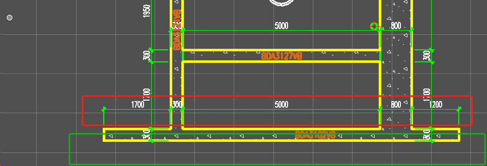

### 尺寸标注拆分合并分区

连续尺寸标注的拆分工具（单独dll）

使用C#做成单独的dll

uorPerMas = 10000

起点 = -110490.2657

那么误差设置为0.1 * UOR_PerMeter即可

总流程：

1. 拆解选中的标注，保留样式，层次等信息，关键在于得到标注点集合和起止点。
2. 点击时根据鼠标定位，计算在原标注上的投影点。
3. 拆分时将此投影点加入点集，以此生成标注即是拆分标注。合并则移出点集中在合理误差内离此投影点最近的点，以此点集生成的标注即是合并标注。