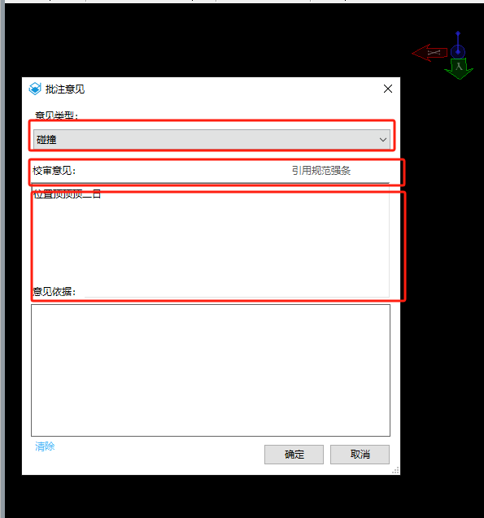

# 注释库

使用C++完成功能，C#完成界面

需求：

遍历文件列表，作为下拉列表一

按行遍历文件内容，作为下拉列表二

读取行内容至可编辑框，作为输出

https://bentleysystems.service-now.com/community?sys_kb_id=c18a88094779c2909091861f536d43a0&id=kb_article_view&sysparm_rank=1&sysparm_tsqueryId=c4e33f181b7b4ad0c864a683604bcbbb

