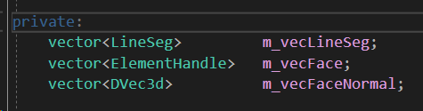
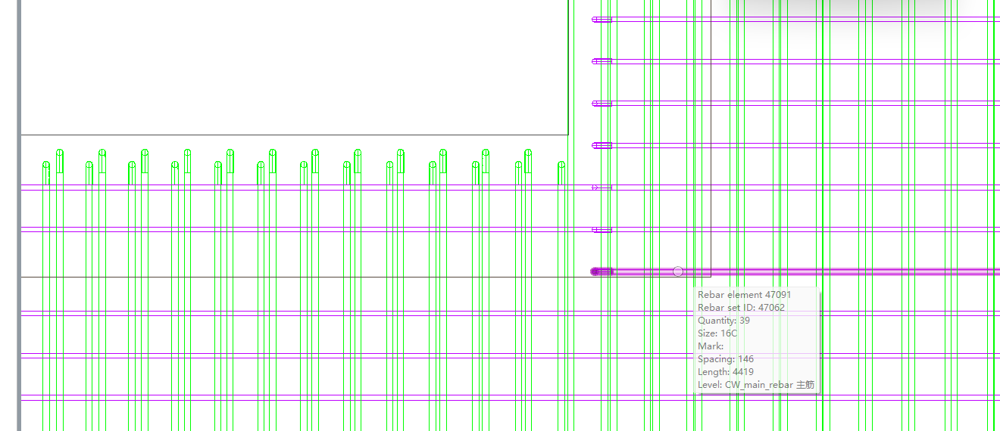

# 笔记

## 2025年2月24日

基本完成自适应面配筋，能够选构件配筋

欠缺：锚固、钢筋横竖排版、钢筋均匀排布

接下来尝试增加锚固功能

### 2025年2月24日18:52:02

通过锚固选择工具，将锚固面信息存入在m_faces。

新的单面配筋还需要配置锚固面的信息

先尝试配置锚固面信息，再尝试钢筋锚固

目标1：通过固定的参数，为钢筋实现锚固

m_faces经过转换后作为

tmpAnchordescrs传入CreateAnchorBySelf

## 2025年2月25日

初版面配筋具备锚固功能，通过界面进行配置

目标：将界面激活使用

### 2025年2月25日15:35:41

面配筋端部样式界面成功创建

需要验证组件的数据绑定完整性

### 2025年2月25日16:31:49

可以成功配置弯锚

但是钢筋水平和竖向设计有误，实际上并没有统一方向

### 2025年2月25日17:17:12

通过移植2代的方向纠正功能，钢筋水平和竖向方向自此固定

但是长度似乎无法成功更改，始终保持在默认长度

是UI的问题

## 2025年2月26日

面配筋端部样式界面与主要配筋切换时，端点属性仅能从端部样式传给主要配筋，导致反复切换会丢失端点属性（锚固属性）

需要增加双向数据传递

### 2025年2月26日15:42:10

在切换标签页和点击事件触发时均保存数据

钢筋起止点错误，水平钢筋的终点到了起点之前，且贴近墙面

### 2025年2月26日16:44:26

修复起止点错误，挪用廊道面配筋逻辑，起止点先前后移动一段距离再和面构件比较，计算保护层后的起止点

目标：修正锚固长度为需求锚固长度

### 2025年2月26日17:56:34

廊道面配筋锚固长度属于独立计算，核岛配筋锚固长度采用PS提供的计算方式，可以根据计算方式替换默认参数

## 2025年2月27日

任务：

更换默认锚固长度

修复弯曲钢筋

锚固起止位置提示

多面互锚

多面联合配筋

### 2025年2月27日11:58:21

默认锚固长度应该根据面所在的内外侧分别计算，如果内侧则使用钢筋直径的15倍，外侧使用GetLae()得到再乘以15倍。

目前在锚固修改界面使用内侧计算方式

“弯曲”钢筋在廊道配筋不被支持，会被直接转化为“无”

### 2025年2月27日14:51:20

Bug：点击直锚直接崩溃

### 2025年2月27日15:28:26

分析：直锚钢筋配置长度时，m_strRebarSize可能不在m_alength列表中，导致使用不存在的值而崩溃

处理：检查后再赋值，修复崩溃

### 2025年2月27日15:52:13

分析：预览钢筋会在MakeRebar最后绘制

问题：钢筋绘制的部分线条和实际钢筋位置不相同

### 2025年2月27日16:07:29

分析：绘制预览线条时，只考虑起止点，但是弯锚钢筋的起止点在弯锚后的位置。

解法1：在存入预览线条时，只存入钢筋主体的起止点

解法2：使用其它的数据结构绘制预览线条，争取绘制钢筋主体和弯锚情况

### 2025年2月27日18:01:53

解法：在存入线条时，使用rebarCurvesNum记录的所有点，最后绘制线串

## 2025年2月28日

解法：在绘制完成钢筋后，应该直接使用rebarCurvesNum绘制预览线，它已经拥有了所有合理的钢筋线条

### 2025年2月28日14:10:17

完成钢筋线预览

目标：单体多面互锚功能

先分析原面配筋单体多面互锚功能

### 2025年2月28日17:43:48

争取优化配筋结构设计，将钢筋各项计算提取并独立解耦。

通用的功能放置到FacesRebarAssemblyEx

## 2025年3月3日

任务：

分析原面配筋多面互锚

新面配筋加入多面互锚

次要任务：

新面配筋各类处理功能提取为独立函数

### 2025年3月3日11:39:57

分析：多面互锚会根据选择面的情况，在逐个面配筋时将需要锚固的面加入到m_anchorFaces。经过处理后使用CreateAnchorBySelf调整锚固，锚固关系会涉及内外侧，板墙斜面，耦合性非常高。

优化：

1.手动定义内外侧，对于不同的情况确认锚固关系

2.不考虑内外侧，仅考虑锚固

### 2025年3月3日16:22:45

暂不考虑互锚，因为锚固关系暂无法在不依赖内外侧的情况完成

改为可自定义钢筋额外的延伸长度

目标：分析钢筋偏移的用途，再考虑增加“画线确定延伸钢筋长度”功能

## 2025年3月4日

任务：

分析原面配筋钢筋端部偏移处理方式

修复新面配筋钢筋端部偏移

增加“画线工具确定延伸钢筋长度”功能

### 2025年3月4日13:38:51

在makeRebarCurve中，可以拿到分割后的钢筋起止点，此时再对起止点进行端部位置偏移

### 2025年3月4日15:41:28

在操作向量时，可以用DifferenceOf确定方向。

在操作点时，可以用SumOf向某个方向移动点，注意它会用向量长度，有必要可以先把向量归零

### 2025年3月4日17:59:13

参考廊道剖段线，实现手绘偏移长度线

还需要参考选择锚固面工具了解如何传递MFC

## 2025年3月5日

任务：

增加“画线工具确定延伸钢筋长度”功能

增加单体多面联合配筋

### 2025年3月5日14:10:23

完成“画线工具确定延伸钢筋长度”功能

接下来分析单体多面配筋的具体实现

mdl load intelligentrebar_LD;rrebarld_hd place customizerebar

### 2025年3月5日16:50:34

分析自定义配筋，了解钢筋如何弯曲到多面

自定义配筋在核岛配筋项目中存在，廊道自定义配筋暂时无法使用，可能是版本过低

### 2025年3月5日17:44:47

面配筋可能还有调用配筋模板的功能没有迁移完成

## 2025年3月6日

任务：

理解多段钢筋曲线的绘制方式

### 2025年3月6日15:23:40

优化自定义配筋Create逻辑，更加容易阅读，代码量从一千多行缩短到120行

每一根钢筋曲线位置通过自定义曲线点逐渐按照设定的方向以及间距偏移得到

### 2025年3月6日16:36:10

基本理解多段钢筋曲线的绘制方式

分析多面连通配筋的实现计划

## 2025年3月7日

任务：

分析多板面联合配筋

拟定多面连通配筋实现计划

### 2025年3月7日09:44:16

多板面联合配筋的使用条件苛刻，必须两板完全相接且水平等高才可能可以配筋

多面连通配筋时，可以考虑先存储所有钢筋线点数据，再根据连通的面，将可延伸的钢筋连接到连通面

难点：

1：部分拐角是已经不在面范围内，仅面上钢筋无法连接

2：水平面和竖直面钢筋可能无法对齐，因为在XYZ轴对于水平竖直的判断在XY不同朝向的面之间不统一

### 2025年3月7日11:13:15

1之解法：

a:根据已知面的lineSeg1和lineSeg2可以确定钢筋配筋范围平面

b:将相邻两面的平面延伸一定距离（延长距离暂未定，可以是所在实体厚度）求平面的共线

c:共线实则为钢筋可以延长到的位置，在该位置创建拐角。

### 2025年3月7日11:43:15

在X方向的板面，垂直面还需要参考之前做过的优化

如果是垂直面，则会反转里外层配筋信息

### 2025年3月7日15:03:42

找到对于解法1可能有用的API：

CurveCurve::IntersectionsXY	求交
mdlIntersect_allBetweenExtendedElms	获取两个元素无线扩展后之间的所有交点。

目标：

实现多面连通配筋

### 2025年3月7日15:42:06

通过面板配置多面连通配筋逐步创建

## 2025年3月10日

任务：

通过面板配置多面连通配筋逐步创建

### 2025年3月10日10:39:03

找到共线时，只将垂直于共线的钢筋线进行延伸

计算顺序：

1. 计算出每一面各自的全部钢筋起止点；

2. 2根据钢筋的LineSeg创建面，使用mdlIntersect_allBetweenExtendedElms得到面无线扩展后之间的所有交点。

3. 2直接用LineSeg延长后求交点，但是此时不适配面配筋原始的钢筋偏移方案，可以考虑只参考一个面进行偏移，可以直接省略另一个面的配筋，但是可能会丢失孔洞避让功能，不妥。

4. 2将所有面的所有钢筋起止点保存，因为钢筋排布已经固定，在多面等宽的情况下，应该可以在延长时轻易得到交点，略微容许误差即可，将交点加入钢筋点位。需要注意可能钢筋有配置弯锚，会影响延长的处理，检测为多面配筋且此侧有平面时（参考多面互锚处理方式）（根据平面几何中心确定平面关系）（根据已确定的钢筋线），将端部样式设为None，最后将钢筋线的两个点作为线延长取交点。

   

   

   可以将根据点绘制钢筋的功能封装；

面配筋可能可以适用策略模式

### 2025年3月10日13:55:55

预览按钮的触发前奏应该和确定按钮相同，考虑将其中的代码封装，即可保证预览和实际效果同步

### 2025年3月10日15:15:04

尝试创建多面联合配筋，和单面配筋最大的区别在于需要考虑面之间的关系，并将钢筋线信息存储，在合适的时机再绘制。

## 2025年3月11日

任务：

根据原先的面配筋，逐步拆解拼接，实现多面联合配筋所需要的功能结构

### 2025年3月11日09:39:59

思考不等宽的面联合配筋，钢筋间距不相同，很难联合。除非使用固定间距。

### 2025年3月11日15:22:42

多面配筋应该在界面层就将每一面的数据存储

在绘制之前，已经拿到以下所有信息，且顺序为选择钢筋

## 2025年3月12日

任务：

联合配筋修复偏移以及保护层规划

提取钢筋绘制代码

相交钢筋连接

### 2025年3月12日10:45:20

修复偏移以及保护层规划，需要在绘制每一面时存储m_face内容

似乎有因为多次循环导致的偏移过度

### 2025年3月12日11:59:34

修复偏移过度问题，offset在循环中多次添加了钢筋层次偏移且未初始化

接下来处理钢筋绘制代码

先通过面关系移除钢筋端部样式

使用特定的容器存储所有需要的钢筋线

### 2025年3月12日14:26:41

多面联合的钢筋全部被归为了一组，争取分隔开，可能非必要，待事成后再做讨论

## 2025年3月13日

任务：

处理钢筋相交

相接位置钢筋端部样式消除

### 2025年3月13日09:23:27

DSegment3d::IntersectXY可以得到在两根线上分别的交点，尝试通过z轴判断是否真实相交

### 2025年3月13日14:15:03

IntersectXY在三维中不适用，比较麻烦

mdlVec_intersect	求三维直线无限延伸的交点

根据首尾关键点找到离对面最近的一端，然后相对应取首尾最近的点组成线段进行求交点

基本的Z型板可以实现钢筋连通

有Z型板的连续平面缺失钢筋，待调查

### 2025年3月13日15:00:27

如果选择顺序是在坐标系从高到低，则需要在连通时，确定存储钢筋关键点的顺序。

采用面的中点逐坐标XYZ比较高低

目前能够成功连通

## 2025年3月14日

任务：

处理锚固部分可能连通钢筋

多体多面互锚钢筋

### 2025年3月14日10:08:37

判断钢筋两端锚固样式，如果均有锚固，则不连通

如果首尾距离邻接面中心点距离基本相同，也不连通（可能是一端有锚固的横向于邻接面的钢筋）

### 2025年3月14日11:27:28

多体多面互锚配筋

先尝试解决目前只能选择一个体的情况

在SelectFaceTool

## 2025年3月17日

任务：

修复自适应配筋对于斜面的处理

单体多面互锚

多体多面互锚

多体多面连通

### 2025年3月17日17:57:57

尝试修改SelectFacetool计划有误

实际应该直接挪用核岛出图的Tool结构

## 2025年3月18日

任务：

多体多面选择

分析连通和互锚可行性

### 2025年3月18日10:27:07

通过核岛出图的Tool结构完成基本的多体多面选择

接下来尝试将选择的数据处理并给到新面配筋

### 2025年3月18日11:57:01

还是需要把一些孔洞钢筋等信息放到InstallNewInstance

只有最后调用具体配筋时到FaceFunc中进行

### 2025年3月18日16:15:04

成功能够多体多面选择配筋

考虑到锚固可以通过配置完成，连通的优先级可以更高

面配筋从进入开始就依赖单体元素，需要分析多体如何融入

### 2025年3月18日17:38:03

方案1：新建一个类用于实现多体相关操作

方案2：在原有的基础上，增加多体的应对，在每个面对应的实体进行操作，比如在操作孔洞时，优先只处理本体的孔洞，其它实体的孔洞大概率也不会有影响

在新建时就直接给入选择元素集和实体元素id

在处理时提取面所在的元素集和实体元素id

仍然将钢筋信息存储，在最后尝试拼接，仍然不拼接本面的钢筋

目前不考虑不等宽的面连通（如果必须考虑，可以尝试将接近的钢筋强行连通或者根据钢筋1的方向延长到钢筋2的最远位置并删除钢筋2）下下策为重新构思连通的逻辑

## 2025年3月19日

任务：

多面连通

### 2025年3月19日09:56:46

找到所有跟选中实体有关的位置，分析如何将单体升级为多体处理。

构造函数FacesRebarEx(eeh, solidElemIds[index++], faces);

CFacesRebarDlgEx(eeh, eehnew, faces, CWnd::FromHandle(MSWIND));

### 2025年3月19日17:40:08

新任务，修复发现的问题

目前主要在墙配筋的内外侧判断、Z型墙内侧钢筋延伸导致的一系列问题

## 2025年3月20日

任务：

分析廊道配筋问题并整理

### 2025年3月20日16:56:43

整理得到任务：

1. Z型墙延伸钢筋提前截断至不碰撞的位置
2. 9Y-3段顶板上部极短墙异形钢筋修复（内外侧）
3. 9Y-4段B-B内侧钢筋末端没有偏移收缩
4. 9y-8段D-D面配筋端部弯锚锚入孔洞
5. 9Y-10段A-A内侧钢筋末端没有偏移收缩
6. 9Y-6段B-B剖切图、C-C剖切图、E-E剖切图顶板上方墙钢筋碰撞。两侧钢筋需要保持同等高度（取消内外侧）
7. 9Y-12段A-A剖切图有多余钢筋。提前截断保护层外的钢筋
8. 9Y-12段E-E剖切图、F-F剖切图墙配筋锚固位置偏高。处理点筋横筋冲突
9. 

## 2025年3月21日

任务：

配筋任务列表

锚固长度需要为平直段长度+弯折段长度

墙与墙锚固为0.8*lae

### 2025年3月21日14:52:07

### 优化 #82652 配筋锚固长度修改：锚固长度为弧段投影长度+直段锚固长度；墙墙锚固长度为0.8Lae；墙板锚固长度为Lae

分析：墙板面的锚固长度是分开的，需要逐个修改

措施：在设计锚固时，将计算好的直段长度-弯锚长度即可

解决：墙配筋修改CalRebarEndTypes

面配筋在MakeRebars（多参数）

板配筋在MakeRebars（多参数）

墙配筋在锚固关系确定后，如果锚固点通过ISPointInHoles判断在墙元素内，则使用以下公式，修改直段锚固长度达到0.8Lae

n * a + b = 0.8 * (a + b)推导得到：n = 0.8 - 0.2 * (b / a)

## 2025年3月24日

任务：

Z型墙延伸钢筋提前截断至不碰撞的位置

9Y-3段顶板上部极短墙异形钢筋优化（内外侧）

### 2025年3月24日11:22:09

优先任务完成廊道配筋需求文档

编写：项目需求分析报告
更新：软件开发方案设计说明

先把拿到的文档粗略看一遍大纲，然后分析需求分析报告如何编写

### 2025年3月24日14:24:34

甲方需要墙墙锚固的0.8Lae为一组相同

但是尝试在源头修改倍率，略微短于目标长度6mm

待文档编写完成后再做修改

### 2025年3月24日15:21:27

已完成封面和签名

参考项目建议书完成需求分析

## 2025年3月25日

任务：

完成文档

### 2025年3月25日15:26:12

墙配筋锚固的0.8Lae其实不需要修改，本身就已经改为0.8Lae

经过锚固长度修复后已经没有问题

### 2025年3月25日17:48:28

面配筋在检查锚固时，第一步的在实体内用的本实体是开空前的，所以无法检测在孔洞中

直接引用testeeh会导致崩溃

使用EditElementHandle*复制testeeh再传入

## 2025年3月26日

任务：

1. **优化 #82752** Z型墙延伸钢筋提前截断至不碰撞的位置
2. **优化 #82753** 9Y-3段顶板上部极短墙异形钢筋修复（内外侧）
3. **优化 #82755** 9Y-4段B-B内侧钢筋末端没有偏移收缩
4. **优化 #82757** 9y-8段D-D面配筋端部弯锚锚入孔洞
5. **优化 #82758** 9Y-10段A-A内侧钢筋末端没有偏移收缩
6. **优化 #82759** 9Y-6段B-B剖切图、C-C剖切图、E-E剖切图顶板上方墙钢筋碰撞。两侧钢筋需要保持同等高度（取消内外侧）
7. **优化 #82760** 9Y-12段A-A剖切图有多余钢筋。提前截断保护层外的钢筋
8. **优化 #82761** 9Y-12段E-E剖切图、F-F剖切图墙配筋锚固位置偏高。处理点筋横筋冲突

### 2025年3月26日09:14:59

已完成：

**优化 #82757** 9y-8段D-D面配筋端部弯锚锚入孔洞

原先进行锚固冲突检测的自身实体是开孔前的，所以无法检测到孔洞

使用选择的实际实体句柄进行冲突检测即可

接下来处理内外侧的主要问题

分析墙的内外侧判断逻辑，考虑参考面配筋修复后的判断逻辑

### 2025年3月26日11:36:43

**优化 #82753** 9Y-3段顶板上部极短墙异形钢筋修复（内外侧）

分析：在ReCalExtendDisByTopDownFloor控制钢筋端部位置偏移距离

措施：优先修改内外侧逻辑，或者增加新的判断，此类板上墙可以起止端分别计算内外侧。基本可以解决。仍需分析内外侧判断逻辑后再做决定

### 2025年3月26日17:58:05

分析：墙配筋在确定起止端偏移时本身就会分别判断内外侧，原先的设计是如果没有板，起止端都会根据起始端的内外侧情况设定偏移

解决：如果确实没有板，则不考虑内外侧

问题：在墙配筋时包含有一组钢筋就会崩溃

解决：有部分钢筋可以有某些属性，在获取name和type时就排除这种错误

分析：没有板时自锚的锚固长度已经排除弯曲半径，在锚固长度优化后，过于短。考虑在自锚计算长度时不排除弯曲半径，之后统一计算

## 2025年3月27日

### 2025年3月27日15:30:55

**优化 #82755** 9Y-4段B-B内侧钢筋末端没有偏移收缩

分析：墙配筋采用路径中点在板内确认内外侧，但是9y-4顶板中间有缺口

措施：将内外侧判断点增加为起点中点终点

### 2025年3月27日18:02:14

9y-4板配筋锚固方向错误

## 2025年3月28日

任务：

1. **优化 #82752** Z型墙延伸钢筋提前截断至不碰撞的位置
2. **优化 #82755** 9Y-4段B-B内侧钢筋末端没有偏移收缩
3. **优化 #82758** 9Y-10段A-A内侧钢筋末端没有偏移收缩
4. **优化 #82760** 9Y-12段A-A剖切图有多余钢筋。提前截断保护层外的钢筋
5. **优化 #82761** 9Y-12段E-E剖切图、F-F剖切图墙配筋锚固位置偏高。处理点筋横筋冲突

### 2025年3月28日09:08:06

**优化 #82755** 9Y-4段B-B内侧钢筋末端没有偏移收缩

问题：处理此问题时，发现板配筋内侧锚固方向有误。

板配筋最近的一次修改是防止与自适应面配筋的参数出图崩溃

可能自适应面配筋需要另外使用参数。

分析：还原修改仍然锚固错误

### 2025年3月28日14:00:35

**优化 #82755** 9Y-4段B-B内侧钢筋末端没有偏移收缩

解决：板配筋出现的相关问题是因为计算锚固位置时，没有将锚固弯曲段长度考虑在内。与墙配筋中出现过的问题相同

### 2025年3月28日14:29:03

**优化 #82758** 9Y-10段A-A内侧钢筋末端没有偏移收缩

已经在解决内外侧问题时同时解决

**优化 #82752** Z型墙延伸钢筋提前截断至不碰撞的位置

措施：考虑控制延伸长度，最多只延伸板的厚度距离

## 2025年3月31日

1. **优化 #82752** Z型墙延伸钢筋提前截断至不碰撞的位置
2. **优化 #82760** 9Y-12段A-A剖切图有多余钢筋。提前截断保护层外的钢筋
3. **优化 #82761** 9Y-12段E-E剖切图、F-F剖切图墙配筋锚固位置偏高。处理点筋横筋冲突

### 2025年3月31日09:34:09

分析：钢筋与墙板通过GetIntersectPointsWithHole可以得到在板上的交点，通常是贯穿板得到的最大最小二点，但是不排除可能有孔洞的情况下出现多个点

### 2025年3月31日17:27:24

措施：限制延伸长度，按照与起点的距离排序交点，计算相邻交点之间的距离，限制不超过楼板厚度。如果交点间距离超过楼板厚度，调整第二个交点位置，且结束延伸

问题：外侧似乎需要更多延伸，但是内外侧判定有问题，墙的内外侧是每一组钢筋分别判定，而且判定依据有问题

## 2025年4月1日

1. **优化 #82752** Z型墙延伸钢筋提前截断至不碰撞的位置
2. **优化 #82760** 9Y-12段A-A剖切图有多余钢筋。提前截断保护层外的钢筋
3. **优化 #82761** 9Y-12段E-E剖切图、F-F剖切图墙配筋锚固位置偏高。处理点筋横筋冲突

### 2025年4月1日11:58:25

**优化 #82752** Z型墙延伸钢筋提前截断至不碰撞的位置

分析：墙配筋配置中的内外侧是决定钢筋在墙的哪一边，不能通过配置来决定内外侧的钢筋特性。

解决：只处理内侧水平钢筋

问题：9Y-11段A-A剖切图墙钢筋丢失

分析：还是内外侧的问题，横向钢筋仍然采用类似原来竖向钢筋的内外侧判定方式，左右侧都在板的范围内说明为内侧面。但是左边的板过于小，所以内外侧判定出现问题。

### 2025年4月1日19:23:36

**优化 #82760** 9Y-12段A-A剖切图有多余钢筋。提前截断保护层外的钢筋

分析：板钢筋也采用依据初始钢筋位置偏移来绘制该组钢筋，遭遇异形板（此处为梯形板）边界时无法检测保护层。

措施：
一：找到异形板的所有关键点，如果生成的钢筋接近关键点，按照最小长度绘制

二：与之前绘制的钢筋比较，同化最近一根的长度

## 2025年4月2日

1. **优化 #82760** 9Y-12段A-A剖切图有多余钢筋。提前截断保护层外的钢筋
2. **优化 #82761** 9Y-12段E-E剖切图、F-F剖切图墙配筋锚固位置偏高。处理点筋横筋冲突

### 2025年4月2日09:11:43

**优化 #82760** 9Y-12段A-A剖切图有多余钢筋。提前截断保护层外的钢筋

ExtractCellPoints可以提取面的所有关键点

### 2025年4月2日14:52:11

尝试：修改板的属性，将边缘作为孔洞。但是并没有识别出孔洞并进行避让。

措施：在确定钢筋起止点后，使用关键点投影并计算距离，如果关键点与投影点在XOY平面上的距离在保护层内，则可能是问题钢筋。

如果关键点在起止点范围外，则不处理。

如果关键点在起止点范围内，则向关键点移动一定距离再与板求交点，最后在返回一段距离。

## 2025年4月3日

1. **优化 #82760** 9Y-12段A-A剖切图有多余钢筋。提前截断保护层外的钢筋
2. **优化 #82761** 9Y-12段E-E剖切图、F-F剖切图墙配筋锚固位置偏高。处理点筋横筋冲突

### 2025年4月3日16:47:05

mdlVec_projectPointToLineInView

尽量不要用这个函数，目前不理解为什么有时不遵守视图规则

可以用**mdlVec_projectPointToLine**，具体使用方式已经记录在API记录中

## 2025年4月7日

**优化 #82761** 9Y-12段E-E剖切图、F-F剖切图墙配筋锚固位置偏高。处理点筋横筋冲突

### 2025年4月7日14:56:42

暂时无法解决**优化 #82761**

### 2025年4月7日17:08:29

BGH存在的问题：

1. 墙配筋在Z型板的延伸还需要优化
2. 1BGH-1段A-A剖切图墙配筋应该锚入上方板中
3. 
4. 1BGH-6段H-H剖切图板配筋钢筋丢失

### 2025年4月7日19:23:04

墙配筋在Z型板的延伸还需要优化

在多次遇到板时计算更近的板出现问题，明明应该是同一个点，但是计算出的距离有80万，可能不应该用*interStrPts.end()，应该用interStrPts.back()

## 2025年4月8日

1. **优化 #83556**1BGH-1段A-A剖切图墙配筋应该锚入上方板中

2. **错误 #83557**1BGH-1段A-A剖切图墙配筋底部碰撞

3. **错误 #83558**1BGH-6段H-H剖切图板配筋钢筋丢失

4. **优化 #83559**Z型墙，延伸的墙配筋超过保护层需要提前截断

### 2025年4月8日16:44:14

**优化 #83559**Z型墙，延伸的墙配筋超过保护层需要提前截断

尝试挪用异形板的处理逻辑，目前仅处理水平钢筋，所以只考虑Z轴的保护层

但是大部分Z型墙的钢筋边缘在相邻板上

### 2025年4月8日19:15:22

既然目前只处理Z型墙水平钢筋延伸到板时的情况，那么在延伸长度位置进行处理也未尝不可

如果是外侧水平钢筋，则需要和延伸到板的关键点进行分析，如果竖直方向上距离小于保护层，则应该也只延伸板厚度

## 2025年4月9日

1. **优化 #83556**1BGH-1段A-A剖切图墙配筋应该锚入上方板中

2. **错误 #83557**1BGH-1段A-A剖切图墙配筋底部碰撞

3. **错误 #83558**1BGH-6段H-H剖切图板配筋钢筋丢失

4. **优化 #83559**Z型墙，延伸的墙配筋超过保护层需要提前截断

### 2025年4月9日09:43:56

**错误 #83557**1BGH-1段A-A剖切图墙配筋底部碰撞

可能是内外侧判定的问题，尝试用两个点以上作为内侧

### 2025年4月9日11:58:10

**优化 #83559**Z型墙，延伸的墙配筋超过保护层需要提前截断

没有取到元素的点，尝试加入新的类型，调试查看板的类型是否兼容

### 2025年4月9日16:04:19

获取到的类型枚举值不在枚举列表中，直接将板拆成面再将所有的点存到一起进行操作

外侧水平钢筋成功收缩，但是某些与板的连接处不应该截断，待处理

## 2025年4月10日

1. **优化 #83556**1BGH-1段A-A剖切图墙配筋应该锚入上方板中

2. **错误 #83557**1BGH-1段A-A剖切图墙配筋底部碰撞

3. **错误 #83558**1BGH-6段H-H剖切图板配筋钢筋丢失

4. **优化 #83559**Z型墙，延伸的墙配筋超过保护层需要提前截断

### 2025年4月10日09:07:15

**优化 #83559**Z型墙，延伸的墙配筋超过保护层需要提前截断

在下图的情况可能会导致左边出图钢筋缺口

### 2025年4月10日11:51:35

**错误 #83558**1BGH-6段H-H剖切图板配筋钢筋丢失

暂时想不出来能够过滤墙上短墙的情况

### 2025年4月10日15:18:50

**优化 #83556**1BGH-1段A-A剖切图墙配筋应该锚入上方板中

原先的判断钢筋起止方向延长逻辑有漏洞，无法检测墙仅有顶板的情况。
使用投影得到的分数判断延伸点位置来进行优化

### 2025年4月10日16:17:16

**优化 #83559**Z型墙，延伸的墙配筋超过保护层需要提前截断

虽然可以避免保护层内的钢筋延伸，但是部分钢筋即使超过板的保护层，但是却属于板墙共同的结构内，此时可以考虑延伸

措施：顶板的低位钢筋可以延伸，底板的高位钢筋可以延伸

### 2025年4月10日19:34:14

**错误 #83558**1BGH-6段H-H剖切图板配筋钢筋丢失

尝试在通过墙分区之前，把重叠且包含的墙中较小的墙去除

## 2025年4月11日

1. **错误 #83558**1BGH-6段H-H剖切图板配筋钢筋丢失
2. **错误 #83557**1BGH-1段A-A剖切图墙配筋底部碰撞

### 2025年4月11日10:56:23

**错误 #83558**1BGH-6段H-H剖切图板配筋钢筋丢失

措施：把重叠且包含的墙中较小的墙去除。根据指定方向（X、Y 或 Z）比较墙面的范围，移除被包含的墙面。同时排除短小墙体影响真实整体墙体的情况，对于 X 方向，额外检查 Z 跨度比例（小于 80%）。对于 Z 方向，检查 X 跨度比例（小于 80%）

### 2025年4月11日15:05:04

**错误 #83557**1BGH-1段A-A剖切图墙配筋底部碰撞

可能通过优化后的内外侧判断，得到了部分缓解

### 2025年4月11日17:09:17

完成廊道整体配筋并出图检查

## 2025年4月14日

配合测试

### 2025年4月14日14:45:40

拿到正确的剖面图

无法进行详细标注的顶板配筋图，待相关开发者修改

### 2025年4月14日18:27:49

在需要存储的结构体中，尽量避免使用string

`std::string` 是一个 **复杂类型**，其内部可能含有指针、内存块等，**不能直接用二进制存储/恢复**。

把 `std::string` 的结构体强转回来会导致 **内存非法访问、程序崩溃或者读取乱码**。

建议字符串使用char数组，这样结构体就成为了 **POD 类型**，可以安全地序列化/反序列化

## 2025年4月15日

### 2025年4月15日14:02:47

9y-5顶板是两块倾斜角度不同的面，墙配筋如果一次配筋，则极有可能会因为只能遵守一面的角度而在另一面一端裸露

9y-6错误板模型位置的顶端钢筋裸露在外

### 2025年4月15日18:14:51

墙的内外侧判断还有问题

考虑采用饱和式判断法：尽可能使用更多的点去判断，可以自定义点的数量，判断为内侧需要的数量

## 2025年4月17日

### 2025年4月17日15:09:49

墙配筋ReCalExtendDisByTopDownFloor在处理板时有逻辑漏洞，会过滤一种范围的板，目前无法测试。将相关代码注释来暂时解决问题，影响较小

