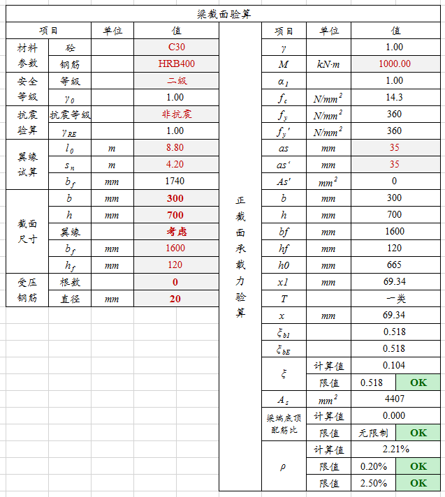

# 配筋率和配筋量统计

## 需求

- 单独的dll和ma
- 可三维选构件以及树状图选择构件
- 分别计算配筋率和配筋量
- 配筋率和配筋量提供动态接口

## 描述

按构件统计配筋率和配筋量，按混凝土立方量统计和百分比统计，增加配筋率和配筋量属性，可按构建批量导出表格。
1.配筋率=钢筋截面面积/构件截面面积。
2.配筋量占比=钢筋重量/钢筋混凝土总重量。

## 实现

### 创建基本项目

1. 创建基础的项目RebarRatioAndQuantity，能够生成

### 通过命令可以三维选构件以及树状图选择构件

首先理解核岛出图中三维选构件以及树状图选择构件功能的具体实现方式。

能够实现通过命令判断已选构件还是弹出树状图选择构件

问题：fatal error C1189: #error:  WINDOWS.H already included.  MFC apps must not #include <Windows.h>

可能的解决方案：调换某些头文件的位置，降低含有Windows.h的头文件优先级

核岛土建出图的GenRebarChart可以直接使用

## 任务细分

1. #### 手动选择构件&展开树状图选择构件

   提取到已选中的元素时需要过滤处理

2. #### 获取构件信息计算配筋率和配筋量占比

   疑问1：哪种构件？墙、板、梁----都要

   疑问2：哪个截面？复杂构件如何计算截面----

   疑问3：表格中需要哪些数据？除了配筋率和配筋量之外。还有钢筋类型、直径、截面面积、重量；构件截面面积；钢筋重量；钢筋混泥土总重量

   本身dll可使用，也有接口导出

   有没有对接人

   数据来源，概念

3. #### 导出为表格（dgn绘制or转Excel）

   表格参考：
   

20201105 梁配筋工具（一）——正截面承载力计算 - 112233的文章 - 知乎
https://zhuanlan.zhihu.com/p/340922192

## 配筋率概念以及计算

在桥梁工程中，一般指的是面积配筋率，即受拉钢筋面积与主梁面积之比。 配筋率的计算公式为
$$
ρsv=Asv/(bs)=(n×Asv1)/(b×s)
$$
【配筋率算法】 https://www.bilibili.com/video/BV1yV4y1f7za/?share_source=copy_web&vd_source=d6af0b076884f6bfa98b775afe3413da

【4-1梁的配筋率】 https://www.bilibili.com/video/BV1rw411B7aw/?share_source=copy_web&vd_source=d6af0b076884f6bfa98b775afe3413da