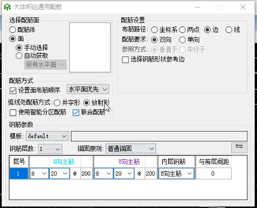
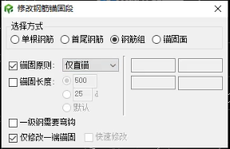
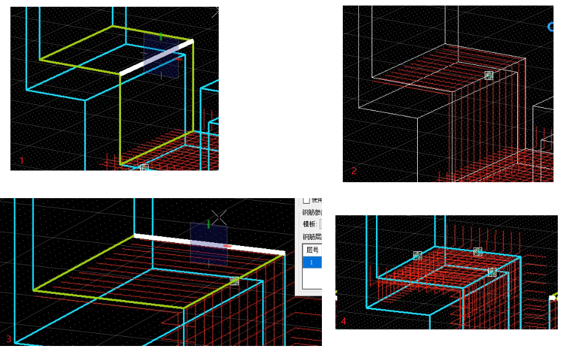
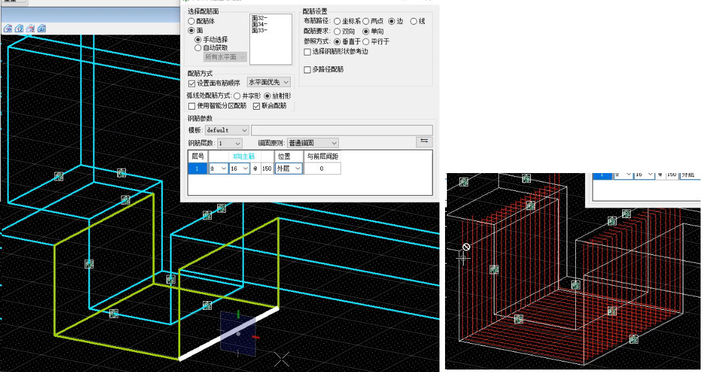
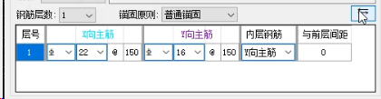
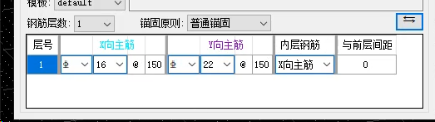
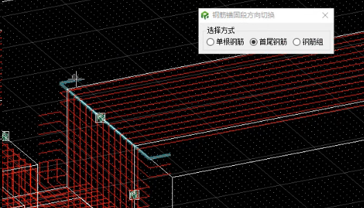
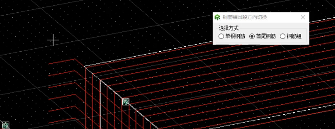

# 面配筋优化

确定配筋需要哪些参数，配筋需要达成的效果，约束标准

## 功能说明：

优化面配筋功能，对于异形面，可快速通过面配筋一键参数化配筋。

操作：

1) 面；先选择实体，再选择配筋面【alt切换面，Ctrl继续选择临近面。(可能还需要shift切换临近实体）】，自动高亮锚固面，可手动选择修改锚固面。

2) 配筋参数。

验证标准：

钢筋位置、直径、锚固无误。

## 分析：

配筋面

锚固面（锚固方向）、锚固长度

钢筋排布对齐

锚固构件参数（厚度）

钢筋主体方向、长度（LineSegment）、开孔前后实体

**基本参数**：层，钢筋方向，直径，类型，间距，起点偏移，终点偏移，与前层间距。

**水平面**（一般是板）：

选择配筋面，配置每层钢筋基本参数，以及锚固方向，长度。

**竖直面**（一般是墙或者Z型板竖直面）：

选择配筋面，配置每层钢筋基本参数，以及锚固方向，长度。

可能会需要锚入其它实体，但是均由操作者配置，属于可控属性。

### 配筋面

选择实体->选择一个面(alt切换)->Ctrl选择下一个临近面，alt切换)->确认配筋

### 钢筋排布对齐

保护层、间距，根据分区均匀计算间距

#### 钢筋排布对齐方式1：

详情：选择钢筋参考边，从钢筋参考边的空间绝对位置从低到高排布钢筋。使用标准间距，标准保护层。

优势：操作简单，上下面采用相同参考边的情况下，大部分钢筋可以对齐。

劣势：仅参考边起始的钢筋符合保护层位置，结束位置可能越过保护层，删除越界钢筋会影响密度。

#### 钢筋排布对齐方式2：

详情：无需参考边，直接使用空间绝对位置从低到高排布钢筋，并根据长度再次微调钢筋间距。

优势：操作简单，上下面只需要长度相同，钢筋均可以对齐。

劣势：对于上下面长度不同时，如Z型板，微调的间距还有钢筋数量都会有影响，无法做到对齐。

#### 钢筋排布对齐方式3：

详情：应对上下面长短不一时，选择分区线，根据每个分区长度微调钢筋间距。

优势：钢筋均可以对齐。

劣势：操作略复杂。

#### 结论：

如果对于周围结构没有特殊的钢筋排布需求，1方式最简单。但是目前需要各种情况的对齐，可能需要按照3方式。

自动模式：单面简单的结构可自动获取周围锚固

手动模式：手动选择主筋配筋面，再选择锚固面（需要检测配筋和锚固合规性，必须为邻近面）

分析多情况，多参数，操作

连通，互锚

## 广核廊道视频分析

### 面配筋（通用配筋）界面：

### 修改钢筋:

### 面配筋基础流程：

选择实体->选择一个面(alt切换)->Ctrl选择下一个临近面，alt切换)->选择第一条布筋路径的参考边->确认配筋

### 参数配置：

配筋要求：应该是钢筋层数，一层或两层。一层时选择为外层或内层，两层时需要选择X或Y方向作为内层。

参照方式：X方向主筋相对于参考边的位置。

锚固原则：锚固方式（普通锚固、仅直锚、仅一次锚固、无锚固）

#### 优势：

逐个面，甚至逐个方向配筋，高度自定义

内外层钢筋一键互换：

#### 劣势：

操作繁琐，无锚固方向，锚固长度，仍需要手动修正

